# Financial & Market Analysis Workspace

Welcome to your quantitative financial research workspace. This workspace contains a collection of complementary datasets covering stock price history (OHLCV), corporate fundamentals, SEC regulatory filings, institutional ownership, news sentiment, and macroeconomic indicators.

---

## 📂 Directory & Dataset Registry

All raw datasets are located inside the [data/](file:///home/maxdemarzi/rogue/data/) folder.

### 1. `data/simfin/` (SimFin Fundamental Data & Share Prices)
* **Description:** Normalized company metadata, financial statements (Income, Balance, Cashflow), and share price metrics cached locally via the SimFin Python API.
* **Key Files:** Located in [data/simfin/simfin_data/](file:///home/maxdemarzi/rogue/data/simfin/simfin_data/).
* **Major Columns:**
  * `Ticker`, `Revenue`, `Net Income`, `Assets`, `Liabilities`, `Share Price`, etc.

### 2. `data/ohlcv/` (Multi-Asset Price History)
* **Source:** [benjaminpo/finance-dataset](https://www.kaggle.com/datasets/benjaminpo/finance-dataset)
* **Description:** Cumulative daily (`1d`) and weekly (`1wk`) historical OHLCV data + dated 1-minute (`1m`) and 5-minute (`5m`) intraday snapshots for ~12,000 tickers across multiple global exchanges (US, EU, JP, KR, HK) as well as cryptocurrencies, FX, indices, rates, and futures.
* **Key Directories:** [data/ohlcv/](file:///home/maxdemarzi/rogue/data/ohlcv/).
* **Format:** Grouped by asset category and interval (e.g., `data/ohlcv/stocks_us/1d/AAPL.csv`).
* **Major Columns:**
  * `Datetime` (UTC, ISO-8601), `Open`, `High`, `Low`, `Close`, `Adj Close`, `Volume`, `Dividends`, `Stock Splits`.

### 3. `data/fundamentals/` (SEC XBRL Company Facts)
* **Source:** [vladosht/fundamental-data-from-sec-xbrl-companyfacts-zip](https://www.kaggle.com/datasets/vladosht/fundamental-data-from-sec-xbrl-companyfacts-zip)
* **Description:** Raw financial statement points parsed directly from SEC XBRL filings database.
* **Key File:** [data/fundamentals/snapshots.csv](file:///home/maxdemarzi/rogue/data/fundamentals/snapshots.csv) (~167 MB).
* **Major Columns:**
  * `snapshot`, `cik`, `date`, `ticker`, `exchange`, `Assets`, `Revenue`, `COGS`, `GrossProfit`, `Equity`, `Liabilities`, `NetCashOperating`, `NetCashFinancing`, `Earnings`, `Shares`, `PublicFloat`, `Employees`.

### 4. `data/insider_trading/` (SEC Smart Money & Form 4 Index)
* **Source:** [nclunaventures/sec-smart-money-dataset-2025-q1](https://www.kaggle.com/datasets/nclunaventures/sec-smart-money-dataset-2025-q1)
* **Description:** Enriched SEC Form 4 (insider transactions) and Form 13F (institutional holdings) indexes.
* **Key Files:** Located in [data/insider_trading/](file:///home/maxdemarzi/rogue/data/insider_trading/).
  * `MASTER_DATA_ENRICHED.csv` (joined & scored transactions)
  * `insider_transactions/insider_transactions_data.csv`
  * `institutional_holdings/institutional_holdings_data.csv`
* **Major Columns:**
  * `cik`, `ownerCik`, `transactionDate`, `shares`, `value`, `isDirector`, `isOfficer`, `transactionCode`, `Institutional Conviction Score`.

### 5. `data/sec_financials/` (Cleaned SEC Statements)
* **Source:** [dominicmalouf/sec-financial-statement-data-sets](https://www.kaggle.com/datasets/dominicmalouf/sec-financial-statement-data-sets)
* **Description:** Pre-cleaned, structural data summaries of US-GAAP financial sheets from regulatory 10-Ks.
* **Key File:** [data/sec_financials/short_financials_df.csv](file:///home/maxdemarzi/rogue/data/sec_financials/short_financials_df.csv).

### 6. `data/financial_news/` (Massive Daily Analyst Ratings & News Headlines)
* **Source:** [miguelaenlle/massive-stock-news-analysis-db-for-nlpbacktests](https://www.kaggle.com/datasets/miguelaenlle/massive-stock-news-analysis-db-for-nlpbacktests)
* **Description:** A large-scale archive of financial news headlines, partner news, and analyst ratings matched to over 6,000 stock tickers.
* **Key Files:** Located in [data/financial_news/](file:///home/maxdemarzi/rogue/data/financial_news/).
  * `analyst_ratings_processed.csv` (~157 MB)
  * `raw_partner_headlines.csv` (~400 MB)
* **Major Columns:**
  * `title` (Headline text), `stock` (Ticker symbol), `date`, `publisher`.

### 7. `data/financial_phrasebank/` (Retail Sentiment Benchmarks)
* **Source:** [ankurzing/sentiment-analysis-for-financial-news](https://www.kaggle.com/datasets/ankurzing/sentiment-analysis-for-financial-news)
* **Description:** The standard **FinancialPhraseBank** dataset, containing financial headlines labeled with sentiment classifications from the retail investor perspective.
* **Key File:** [data/financial_phrasebank/all-data.csv](file:///home/maxdemarzi/rogue/data/financial_phrasebank/all-data.csv).
* **Major Columns:**
  * `sentence`, `sentiment` (`positive`, `neutral`, `negative`).

### 8. `data/macroeconomics/` (Federal Reserve Interest Rates)
* **Source:** [federalreserve/interest-rates](https://www.kaggle.com/datasets/federalreserve/interest-rates)
* **Description:** Interest rate benchmarks from the Federal Reserve Economic Data (FRED).
* **Key File:** [data/macroeconomics/index.csv](file:///home/maxdemarzi/rogue/data/macroeconomics/index.csv).
* **Major Columns:**
  * `date`, `rate`.

### 9. `data/executives/` (Global CEO & CFO Leadership Index)
* **Source:** [leadsblue/global-ceo-and-cfo-leadership-dataset](https://www.kaggle.com/datasets/leadsblue/global-ceo-and-cfo-leadership-dataset)
* **Description:** Contact and identity profiles for C-level executives (CEOs, CFOs) mapped to corporate entities.
* **Key File:** [data/executives/Global CEO and CFO Leadership C- Level Executives Dataset.csv](file:///home/maxdemarzi/rogue/data/executives/Global%20CEO%20and%20CFO%20Leadership%20C-%20Level%20Executives%20Dataset.csv).
* **Major Columns:**
  * `Name`, `Last Name`, `Title`, `co_name` (Company Name), `website`, `Person Linkedin Url`, `Company Linkedin Url`, `Annual Revenue`.

### 10. `data/isin_lei_mapping/` (Global Legal Entity Identifiers)
* **Source:** [westernmagic/isin-lei](https://www.kaggle.com/datasets/westernmagic/isin-lei)
* **Description:** Official GLEIF mappings linking international securities (ISIN) to Legal Entity Identifiers (LEI) to resolve global entity duplicates.
* **Key File:** [data/isin_lei_mapping/isin-lei.csv](file:///home/maxdemarzi/rogue/data/isin_lei_mapping/isin-lei.csv).
* **Major Columns:**
  * `lei`, `isin`.

### 11. `data/business_network/` (Relato Corporate Domain Connections)
* **Source:** [thedevastator/relato-business-network-graph-373663-domain-conn](https://www.kaggle.com/datasets/thedevastator/relato-business-network-graph-373663-domain-conn)
* **Description:** Network domain database linking over 370k companies by client, vendor, partner, and infrastructure connections.
* **Key Files:** Located in [data/business_network/](file:///home/maxdemarzi/rogue/data/business_network/).
  * `companies.csv` (nodes)
  * `links.csv` (relationship edges)
* **Major Columns:**
  * `companies.csv`: `domain` (e.g. `f5.com`), `name`
  * `links.csv`: `home_domain`, `link_domain`, `type`

### 12. `data/ticker_mapping/` (Exchange Ticker Mappings)
* **Source:** [badboyhalo1801/stock-ticker-mapping](https://www.kaggle.com/datasets/badboyhalo1801/stock-ticker-mapping)
* **Description:** Cross-walk tables mapping internal stock IDs to standard public tickers.
* **Key File:** [data/ticker_mapping/ticker_mapping.csv](file:///home/maxdemarzi/rogue/data/ticker_mapping/ticker_mapping.csv).
* **Major Columns:**
  * `stock_id`, `mapped_ticker`, `match_score`.

### 13. `data/esg_ratings/` (Corporate ESG Risk Ratings)
* **Sources:** [pritish509/s-and-p-500-esg-risk-ratings](https://www.kaggle.com/datasets/pritish509/s-and-p-500-esg-risk-ratings) & [alistairking/public-company-esg-ratings-dataset](https://www.kaggle.com/datasets/alistairking/public-company-esg-ratings-dataset)
* **Description:** Environmental, Social, and Governance (ESG) grades, controversy levels, and risk percentiles for public companies.
* **Key Files:** Located in [data/esg_ratings/](file:///home/maxdemarzi/rogue/data/esg_ratings/).
  * `SP 500 ESG Risk Ratings.csv` (S&P 500 subset)
  * `data.csv` (General public company ratings index)
* **Major Columns:**
  * `Symbol` / `ticker`, `cik`, `total_score` / `Total ESG Risk score`, `environment_score`, `social_score`, `governance_score`, `Controversy Level`.

### 14. `data/mergers_acquisitions/` (Worldwide Mega Deals Index)
* **Source:** [rajkumarpandey02/list-of-largest-mergers-and-acquisitions-in-world](https://www.kaggle.com/datasets/rajkumarpandey02/list-of-largest-mergers-and-acquisitions-in-world)
* **Description:** Historical transaction logs of largest global corporate mergers and acquisitions (M&A) valued at $20 billion or greater.
* **Key Files:** CSV deal tables sorted by decade (1980–2019) in [data/mergers_acquisitions/](file:///home/maxdemarzi/rogue/data/mergers_acquisitions/).
* **Major Columns:**
  * `Year`, `Purchaser`, `Purchased`, `Transaction value(in billions USD)`.

### 15. `data/bankruptcy_risk/` (Quantitative Default Risk Probabilities)
* **Source:** [sovairesearch/bankruptcy](https://www.kaggle.com/datasets/sovairesearch/bankruptcy)
* **Description:** Pre-computed monthly probability estimates of corporate bankruptcy risk mapped across time series using multi-model configurations (LightGBM, CNN).
* **Key File:** [data/bankruptcy_risk/bankruptcy.csv](file:///home/maxdemarzi/rogue/data/bankruptcy_risk/bankruptcy.csv) (~214 MB).
* **Major Columns:**
  * `ticker`, `date`, `probability`, `sans_market` (fundamentals vs market variance indicator), `volatility`.

### 16. `data/startup_vc/` (Crunchbase Private Investments)
* **Source:** [arindam235/startup-investments-crunchbase](https://www.kaggle.com/datasets/arindam235/startup-investments-crunchbase)
* **Description:** VC private funding, startup details, seed/angel investment rounds, and funding sizes from Crunchbase.
* **Key File:** [data/startup_vc/investments_VC.csv](file:///home/maxdemarzi/rogue/data/startup_vc/investments_VC.csv).
* **Major Columns:**
  * `permalink`, `name` (Company Name), `homepage_url`, `funding_total_usd`, `seed`, `venture`, `angel`, `round_A`, `round_B`.

### 17. `data/federal_contracts/` (US Federal AI/ML Contracts)
* **Source:** [y2h1987/us-federal-ai-ml-contracts](https://www.kaggle.com/datasets/y2h1987/us-federal-ai-ml-contracts)
* **Description:** US Federal Government AI and Machine Learning contract awards, linking public/private vendors to federal agencies.
* **Key File:** [data/federal_contracts/us_fed_ai_contracts_sample.csv](file:///home/maxdemarzi/rogue/data/federal_contracts/us_fed_ai_contracts_sample.csv).
* **Major Columns:**
  * `contract_award_unique_key`, `recipient_name` (Vendor Name), `awarding_agency_name`, `award_amount`, `start_date`, `end_date`, `parent_recipient_ticker`.

### 18. `data/patent_litigation/` (USPTO Litigation Records)
* **Source:** [dushyantrathore/patent-data](https://www.kaggle.com/datasets/dushyantrathore/patent-data)
* **Description:** Historical patent litigation cases (2000–2021) in the US, capturing legal lawsuit relationships between patent assertion entities (NPEs) and operating companies.
* **Key File:** [data/patent_litigation/Patent_Data.csv](file:///home/maxdemarzi/rogue/data/patent_litigation/Patent_Data.csv).
* **Major Columns:**
  * `case_no`, `filed_date`, `plaintiff`, `parent_company`, `defendant`, `patents` (asserted patent IDs), `closed_date`.

### 19. `data/crypto_holdings/` (Corporate Cryptocurrency Holdings Index)
* **Source:** [anadiskt/cryptocurrency-market-ecosystem-2014-2026](https://www.kaggle.com/datasets/anadiskt/cryptocurrency-market-ecosystem-2014-2026)
* **Description:** Daily timeline tracking treasury Bitcoin holdings and acquisition levels for major publicly traded corporations.
* **Key File:** [data/crypto_holdings/crypto_corporate_bitcoin_holdings.csv](file:///home/maxdemarzi/rogue/data/crypto_holdings/crypto_corporate_bitcoin_holdings.csv).
* **Major Columns:**
  * `Date`, `BTC` (price), and corporate ticker columns (e.g. `MSTR`, `TSLA`, `COIN`, `MARA`, `RIOT`) listing holdings or pricing metrics.

### 20. `data/country_debt/` (Global Sovereign & Private Debt Logs)
* **Source:** [sazidthe1/global-debt-data](https://www.kaggle.com/datasets/sazidthe1/global-debt-data)
* **Description:** Country-level government, household, corporate, and private debt time-series tracking financial leveraging over time.
* **Key File:** [data/country_debt/central_government_debt.csv](file:///home/maxdemarzi/rogue/data/country_debt/central_government_debt.csv).
* **Major Columns:**
  * `country_name`, `indicator_name`, yearly columns from `1950` to `2022`.

### 21. `data/country_gdp_employment/` (Global GDP, Jobs, & Unemployment)
* **Source:** [akshatsharma2/global-jobs-gdp-and-unemployment-data-19912022](https://www.kaggle.com/datasets/akshatsharma2/global-jobs-gdp-and-unemployment-data-19912022)
* **Description:** Macroeconomic tables detailing sector-specific employment divisions, unemployment rates, and annual national GDPs.
* **Key File:** [data/country_gdp_employment/Employment_Unemployment_GDP_data.csv](file:///home/maxdemarzi/rogue/data/country_gdp_employment/Employment_Unemployment_GDP_data.csv).
* **Major Columns:**
  * `Country Name`, `Year`, `Employment Sector: Industry`, `Unemployment Rate`, `GDP (in USD)`.

### 22. `data/sovereign_ratings/` (Country Credit Ratings)
* **Source:** [nikitamanaenkov/sovereign-and-supranational-credit-ratings](https://www.kaggle.com/datasets/nikitamanaenkov/sovereign-and-supranational-credit-ratings)
* **Description:** Standard long-term foreign and local currency credit ratings (Moody's, S&P, Fitch grades) for countries.
* **Key File:** [data/sovereign_ratings/Sovereign_Credit_Ratings.csv](file:///home/maxdemarzi/rogue/data/sovereign_ratings/Sovereign_Credit_Ratings.csv).
* **Major Columns:**
  * `Sovereign` (Country Name), `Rating_foreign`, `Rating_local`.

### 23. `data/naics_contagion/` (Industry Contagion Topology)
* **Source:** [plainr/naic-contagion-map](https://www.kaggle.com/datasets/plainr/naic-contagion-map)
* **Description:** Inter-industry supply chain dependency maps (raw material flows, component streams) based on NAICS categories.
* **Key Files:** Located in [data/naics_contagion/](file:///home/maxdemarzi/rogue/data/naics_contagion/).
  * `NAICS_Contagion_Edges_GitHub.csv`
  * `NAICS_Contagion_Nodes_GitHub.csv`
* **Major Columns:**
  * `Source Node` (Industry category), `Target Node`, `Edge Type`.

### 24. `data/index_constituents/` (Index Holdings & Weights)
* **Source:** [devaangbarthwal/s-and-p-500-holdings-and-weights-spy-2000-2024](https://www.kaggle.com/datasets/devaangbarthwal/s-and-p-500-holdings-and-weights-spy-2000-2024)
* **Description:** Annual constituent membership and weights for the S&P 500 stock index from 2000 to 2024.
* **Key Files:** Yearly CSV listing files in [data/index_constituents/](file:///home/maxdemarzi/rogue/data/index_constituents/).
* **Major Columns:**
  * `Company`, `Weight`, `Ticker`.

### 25. `data/corporate_credit_ratings/` (Corporate Credit Scores)
* **Source:** [firmai/morningstar-corporate-credit-ratings](https://www.kaggle.com/datasets/firmai/morningstar-corporate-credit-ratings)
* **Description:** Historical credit ratings and actions (upgrades, downgrades) issued by major agencies for public corporations.
* **Key File:** [data/corporate_credit_ratings/Morningstar Corporate Credit Ratings - 2019.csv](file:///home/maxdemarzi/rogue/data/corporate_credit_ratings/Morningstar Corporate Credit Ratings - 2019.csv).
* **Major Columns:**
  * `obligor_name`, `rating`, `rating_agency_name`, `rating_action_date`.

### 26. `data/corporate_bonds/` (Corporate Debt & Bond Listings)
* **Source:** [rakeshhansrajani/companybonddata](https://www.kaggle.com/datasets/rakeshhansrajani/companybonddata)
* **Description:** Details of corporate bond issues including coupon rates, maturities, face values, and credit ratings.
* **Key File:** [data/corporate_bonds/CompanyBonds.xlsx](file:///home/maxdemarzi/rogue/data/corporate_bonds/CompanyBonds.xlsx).
* **Major Columns:**
  * `SYMBOL` (Ticker), `BOND TYPE`, `COUPON RATE`, `FACE VALUE`, `CREDIT RATING`, `MATURITY DATE`.

### 27. `data/earnings_estimates/` (EPS Consensus & Surprise History)
* **Source:** [adarsh1077/epsclassification](https://www.kaggle.com/datasets/adarsh1077/epsclassification)
* **Description:** Pre-computed corporate EPS estimates, actual outcomes, beat/miss records, and historical surprise rates for public companies.
* **Key File:** [data/earnings_estimates/earnings_features_clean (1).csv](file:///home/maxdemarzi/rogue/data/earnings_estimates/earnings_features_clean%20(1).csv).
* **Major Columns:**
  * `earnings_date`, `ticker`, `beat` (estimate match indicator), `beat_streak`, `avg_surprise_4q`, `estimate_trend`.

### 28. `data/implied_volatility/` (CBOE Volatility Index VIX)
* **Source:** [volodymyrpivoshenko/cboe-volatility-index-vix](https://www.kaggle.com/datasets/volodymyrpivoshenko/cboe-volatility-index-vix)
* **Description:** Daily historical timeline tracking the CBOE VIX index pricing metrics (open, high, low, close) indicating overall equity market fear and option hedging activity.
* **Key File:** [data/implied_volatility/vix.csv](file:///home/maxdemarzi/rogue/data/implied_volatility/vix.csv).
* **Major Columns:**
  * `DATE`, `OPEN`, `HIGH`, `LOW`, `CLOSE` (VIX pricing levels).

### 29. `data/commodity_prices/` (Global Commodity Prices)
* **Source:** [ibrahimqasimi/global-commodity-prices-2000-2026](https://www.kaggle.com/datasets/ibrahimqasimi/global-commodity-prices-2000-2026)
* **Description:** Daily pricing logs of major global agricultural, energy, and metallic commodities (Gold, Silver, Crude Oil, Natural Gas, Brent Oil, Copper).
* **Key File:** [data/commodity_prices/Global_Commodity_Prices_2000_2026.csv](file:///home/maxdemarzi/rogue/data/commodity_prices/Global_Commodity_Prices_2000_2026.csv).
* **Major Columns:**
  * `Date`, `Ticker`, `Commodity` (Name), `Open`, `High`, `Low`, `Close`, `Volume`.

### 30. `data/supply_chain/` (Supplier & Product Logistics Operations)
* **Source:** [harshsingh2209/supply-chain-analysis](https://www.kaggle.com/datasets/harshsingh2209/supply-chain-analysis)
* **Description:** Logistics and operational characteristics mapping suppliers, product manufacturing costs, defect rates, and shipping costs.
* **Key File:** [data/supply_chain/supply_chain_data.csv](file:///home/maxdemarzi/rogue/data/supply_chain/supply_chain_data.csv).
* **Major Columns:**
  * `Product type`, `SKU`, `Price`, `Revenue generated`, `Supplier name`, `Manufacturing costs`, `Routes`, `Costs`.

### 31. `data/trade_credit/` (Sovereign & Sector Trade Credit Timelines)
* **Source:** [frankmollard/trade-credit-and-financing-costs](https://www.kaggle.com/datasets/frankmollard/trade-credit-and-financing-costs)
* **Description:** National and sector-level accounts receivable dynamics, tracking Days Sales Outstanding (DSO) and financing costs.
* **Key File:** [data/trade_credit/Trade_Credit_and_Financing_Costs.xlsx](file:///home/maxdemarzi/rogue/data/trade_credit/Trade_Credit_and_Financing_Costs.xlsx).
* **Major Columns:**
  * `DATA_DETAIL` (DSO/DPO metrics), `COUNTRY`, `SECTOR`, `SIZE`, annual metrics (2000-2017).

### 32. `data/board_members/` (Fortune 100 Board Director Networks)
* **Source:** [thedevastator/fortune-100-board-member-information](https://www.kaggle.com/datasets/thedevastator/fortune-100-board-member-information)
* **Description:** Corporate board member registry for Fortune 100 companies, enabling network modeling of board interlocking.
* **Key File:** [data/board_members/boardmembers.csv](file:///home/maxdemarzi/rogue/data/board_members/boardmembers.csv).
* **Major Columns:**
  * `BoardMemberName`, `CompanyName`, `Source`.

### 33. `data/global_inflation/` (Global Inflation Dynamics)
* **Source:** [sazidthe1/global-inflation-data](https://www.kaggle.com/datasets/sazidthe1/global-inflation-data)
* **Description:** Inflation rates (CPI changes) per country over annual timeframes, capturing national monetary erosion.
* **Key File:** [data/global_inflation/global_inflation_data.csv](file:///home/maxdemarzi/rogue/data/global_inflation/global_inflation_data.csv).
* **Major Columns:**
  * `country_name`, annual columns (1980–2024).

### 34. `data/corporate_layoffs/` (Layoffs & Distress Timelines)
* **Source:** [swaptr/layoffs-2022](https://www.kaggle.com/datasets/swaptr/layoffs-2022)
* **Description:** Tech and corporate layoffs listings, capturing workforce reduction volumes and funding states.
* **Key File:** [data/corporate_layoffs/layoffs.csv](file:///home/maxdemarzi/rogue/data/corporate_layoffs/layoffs.csv).
* **Major Columns:**
  * `company`, `location`, `industry`, `total_laid_off`, `percentage_laid_off`, `date`, `stage`, `funds_raised`.

### 35. `data/fx_rates/` (Daily Forex Exchange Rates per USD)
* **Source:** [brunotly/foreign-exchange-rates-per-dollar-20002019](https://www.kaggle.com/datasets/brunotly/foreign-exchange-rates-per-dollar-20002019)
* **Description:** Historical daily foreign exchange rates per U.S. dollar for major global currencies.
* **Key File:** [data/fx_rates/Foreign_Exchange_Rates.csv](file:///home/maxdemarzi/rogue/data/fx_rates/Foreign_Exchange_Rates.csv).
* **Major Columns:**
  * `Time Serie`, exchange rate columns (EUR, GBP, JPY, CAD, CNY, CHF, AUD, INR, etc.).

### 36. `data/treasury_yields/` (U.S. Sovereign Yield Curves)
* **Source:** [guillemservera/us-treasury-yields-daily](https://www.kaggle.com/datasets/guillemservera/us-treasury-yields-daily)
* **Description:** Daily sovereign constant maturity yields for 1-month to 30-year US Treasury maturities.
* **Key File:** [data/treasury_yields/ust.csv](file:///home/maxdemarzi/rogue/data/treasury_yields/ust.csv).
* **Major Columns:**
  * `Date`, `1 Mo`, `3 Mo`, `1 Yr`, `2 Yr`, `5 Yr`, `10 Yr`, `30 Yr`.

### 37. `data/ceo_salaries/` (CEO Compensation & Worker Pay Ratios)
* **Source:** [salimwid/latest-top-3000-companies-ceo-salary-202223](https://www.kaggle.com/datasets/salimwid/latest-top-3000-companies-ceo-salary-202223)
* **Description:** Compensation statistics for Russell 3000 and S&P 500 CEOs, detailing base pay, bonus structures, and worker-pay ratios.
* **Key File:** [data/ceo_salaries/ceo_data_pay_merged_r3000.csv](file:///home/maxdemarzi/rogue/data/ceo_salaries/ceo_data_pay_merged_r3000.csv).
* **Major Columns:**
  * `company_name`, `ticker`, `ceo_name`, `total_ceo_pay`, `median_worker_pay`, `pay_ratio`.

### 38. `data/semiconductor_industry/` (Global Chip Supply Chain Financials)
* **Source:** [sergionefedov/global-semiconductor-industry-2010-2026](https://www.kaggle.com/datasets/sergionefedov/global-semiconductor-industry-2010-2026)
* **Description:** Semiconductor foundry capacity listings, chip spot prices, and financials of major hardware companies.
* **Key File:** [data/semiconductor_industry/chip_companies_financials.csv](file:///home/maxdemarzi/rogue/data/semiconductor_industry/chip_companies_financials.csv).
* **Major Columns:**
  * `company`, `ticker`, `revenue`, `operating_margin`, `fab_capacity`, `rnd_spending`.

### 39. `data/aviation_industry/` (Aviation Financials & Fleets)
* **Source:** [sergionefedov/global-aviation-industry-2010-2026](https://www.kaggle.com/datasets/sergionefedov/global-aviation-industry-2010-2026)
* **Description:** Airline financial parameters, passenger traffic indices, and aircraft orders.
* **Key File:** [data/aviation_industry/airline_financials.csv](file:///home/maxdemarzi/rogue/data/aviation_industry/airline_financials.csv).
* **Major Columns:**
  * `airline`, `ticker`, `passenger_revenue`, `load_factor`, `fuel_cost_share`, `fleet_size`.

### 40. `data/pharma_industry/` (Biotech Funding & Drug Approvals)
* **Source:** [sergionefedov/global-healthcare-and-pharma-2010-2026](https://www.kaggle.com/datasets/sergionefedov/global-healthcare-and-pharma-2010-2026)
* **Description:** Pharmaceutical and biotech company pipelines, funding rounds, clinical trial stages, and drug approvals.
* **Key File:** [data/pharma_industry/pharma_companies_financials.csv](file:///home/maxdemarzi/rogue/data/pharma_industry/pharma_companies_financials.csv).
* **Major Columns:**
  * `company`, `ticker`, `clinical_phase_3_count`, `fda_approvals`, `rnd_intensity`.

### 41. `data/billionaire_wealth/` ( Forbes Billionaire Asset Portfolios)
* **Source:** [surajjha101/forbes-billionaires-data-preprocessed](https://www.kaggle.com/datasets/surajjha101/forbes-billionaires-data-preprocessed)
* **Description:** Forbes billionaires database detailing individual net worths, asset origins, and associated companies.
* **Key File:** [data/billionaire_wealth/Forbes Billionaires.csv](file:///home/maxdemarzi/rogue/data/billionaire_wealth/Forbes%20Billionaires.csv).
* **Major Columns:**
  * `Name`, `NetWorth`, `Country`, `Source` (Associated Company), `Industry`.

### 42. `data/interest_rate_spreads/` (Daily Credit Yield Spreads)
* **Source:** [samaffolter/fred-interest-rate-spreads](https://www.kaggle.com/datasets/samaffolter/fred-interest-rate-spreads)
* **Description:** Macro interest rate differentials, including 10Y-2Y yield curves and corporate default risk spreads (Aaa to Baa).
* **Key File:** [data/interest_rate_spreads/FRED_InterestRate_Data.csv](file:///home/maxdemarzi/rogue/data/interest_rate_spreads/FRED_InterestRate_Data.csv).
* **Major Columns:**
  * `Date`, `T10Y2Y`, `BAA10Y`, `AAA10Y` (spread percentages).

### 43. `data/corporate_buybacks/` (Buybacks & Equity Dilution Dynamics)
* **Source:** [aikyatansinha/corporate-buybacks-vs-executive-dilution-dataset](https://www.kaggle.com/datasets/aikyatansinha/corporate-buybacks-vs-executive-dilution-dataset)
* **Description:** S&P 500 company share repurchase metrics mapped against management share grant packages and employee dilution levels.
* **Key File:** [data/corporate_buybacks/Financial_Truth_Dataset.csv](file:///home/maxdemarzi/rogue/data/corporate_buybacks/Financial_Truth_Dataset.csv).
* **Major Columns:**
  * `Company`, `Ticker`, `Share_Repurchase_Amount`, `Executive_Stock_Dilution`, `Capital_Returned_Ratio`.

### 44. `data/sector_returns/` (Daily Stock Market Sector Returns)
* **Source:** [sergionefedov/global-stock-market-returns-by-sector-20002024](https://www.kaggle.com/datasets/sergionefedov/global-stock-market-returns-by-sector-20002024)
* **Description:** Daily performance indices of stock market sectors (Tech, Finance, Energy, Industrials, Utilities, Real Estate, etc.).
* **Key File:** [data/sector_returns/stock_market_daily.csv](file:///home/maxdemarzi/rogue/data/sector_returns/stock_market_daily.csv).
* **Major Columns:**
  * `Date`, sector return columns (Technology, Financials, Healthcare, Consumer_Discretionary, etc.).

### 45. `data/economic_freedom/` (Global National Freedom Indexes)
* **Source:** [lewisduncan93/the-economic-freedom-index](https://www.kaggle.com/datasets/lewisduncan93/the-economic-freedom-index)
* **Description:** Annual sovereign evaluations of property rights, regulatory burdens, tax pressures, and international trade freedom.
* **Key File:** [data/economic_freedom/economic_freedom_index2019_data.csv](file:///home/maxdemarzi/rogue/data/economic_freedom/economic_freedom_index2019_data.csv).
* **Major Columns:**
  * `Country Name`, `Property Rights`, `Tax Burden`, `Government Spending`, `Business Freedom`.

### 46. `data/crude_oil_prices/` (Daily Crude Oil Benchmark Prices)
* **Source:** [saurabhshahane/crude-oil-price-data](https://www.kaggle.com/datasets/saurabhshahane/crude-oil-price-data)
* **Description:** Daily benchmark spot prices for West Texas Intermediate (WTI) and Brent crude oil indices.
* **Key File:** [data/crude_oil_prices/Crude oil and Sustainable Indices - US and India.xlsx](file:///home/maxdemarzi/rogue/data/crude_oil_prices/Crude%20oil%20and%20Sustainable%20Indices%20-%20US%20and%20India.xlsx).
* **Major Columns:**
  * `Date`, `WTI`, `Brent` (spot prices).

### 47. `data/gold_prices/` (Daily Gold Futures Prices)
* **Source:** [sid321axn/gold-price-prediction-dataset](https://www.kaggle.com/datasets/sid321axn/gold-price-prediction-dataset)
* **Description:** Daily constant pricing logs for Gold (USO/SPDR ETF benchmark values).
* **Key File:** [data/gold_prices/FINAL_USO.csv](file:///home/maxdemarzi/rogue/data/gold_prices/FINAL_USO.csv).
* **Major Columns:**
  * `Date`, `Open`, `High`, `Low`, `Close` (gold pricing benchmark limits).

### 48. `data/eu_inflation/` (Eurostat Consumer Price HICP Indexes)
* **Source:** [hgultekin/hicp-inflation-rate](https://www.kaggle.com/datasets/hgultekin/hicp-inflation-rate)
* **Description:** European Union Harmonised Index of Consumer Prices (HICP) detailed product and category indicators.
* **Key File:** [data/eu_inflation/Eurostat_Table_HICPv2.csv](file:///home/maxdemarzi/rogue/data/eu_inflation/Eurostat_Table_HICPv2.csv).
* **Major Columns:**
  * `geo` (European country code), `time` (Year-Month), `value` (monthly index points).

### 49. `data/sweden_macro/` (Sweden Interest Rate & Inflation History)
* **Source:** [cnygaard/sweden-interest-rate-inflation](https://www.kaggle.com/datasets/cnygaard/sweden-interest-rate-inflation)
* **Description:** Multi-decade historical Swedish Riksbank policy interest rates and national inflation indicators.
* **Key File:** [data/sweden_macro/Interestrate and inflation Sweden 1908-2001.csv](file:///home/maxdemarzi/rogue/data/sweden_macro/Interestrate%20and%20inflation%20Sweden%201908-2001.csv).
* **Major Columns:**
  * `Year`, `Interest rate`, `Inflation`.

### 50. `data/uk_cost_of_living/` (UK Longitudinal Living Costs & Wages)
* **Source:** [franekwodarczyk/uk-cost-of-living-vs-salary-2010-2024](https://www.kaggle.com/datasets/franekwodarczyk/uk-cost-of-living-vs-salary-2010-2024)
* **Description:** Longitudinal index matching average British household living costs against median wage growth trajectories.
* **Key File:** [data/uk_cost_of_living/uk_col_salary_longitudinal_2010_2024.csv](file:///home/maxdemarzi/rogue/data/uk_cost_of_living/uk_col_salary_longitudinal_2010_2024.csv).
* **Major Columns:**
  * `Year`, `Average_Salary`, `CPI_Index_Living_Cost`, `Discretionary_Income_Estimate`.

---

## 🔗 Knowledge Graph Relationship Schema

Here is the database schema for the Financial Knowledge Graph. It integrates price history, corporate structure, institutional ownership, news sentiment, macro indicators, and corporate connections:

```mermaid
graph TD
    %% Node Definitions
    Company["(:Company)<br>Properties: Ticker, CIK, Name, Country, Domain"]
    Person["(:Person)<br>Properties: Name, Linkedin, Role, NetWorth"]
    Institution["(:Institution)<br>Properties: Name, CIK, 13F ID"]
    Industry["(:Industry)<br>Properties: Name, Sector"]
    LegalEntity["(:LegalEntity)<br>Properties: LEI, ISIN"]
    SentimentEvent["(:SentimentEvent)<br>Properties: Date, SentimentScore"]
    MacroIndicator["(:MacroIndicator)<br>Properties: Date, Rate, Spread"]
    ESGRating["(:ESGRating)<br>Properties: Score, EnvScore, SocScore, GovScore"]
    BankruptcyRisk["(:BankruptcyRisk)<br>Properties: Date, Probability, Volatility"]
    GovernmentAgency["(:GovernmentAgency)<br>Properties: Name, AgencyCode"]
    Patent["(:Patent)<br>Properties: PatentID"]
    CryptoToken["(:CryptoToken)<br>Properties: Symbol, Name"]
    Country["(:Country)<br>Properties: Name, CountryCode, EconomicFreedom"]
    CountryMacro["(:CountryMacro)<br>Properties: Year, GDP, DebtRatio, UnemploymentRate, InflationRate"]
    SovereignRating["(:SovereignRating)<br>Properties: MoodyRating, LocalRating"]
    MarketIndex["(:MarketIndex)<br>Properties: Name"]
    CreditRating["(:CreditRating)<br>Properties: Score, Agency, Date"]
    Bond["(:Bond)<br>Properties: Coupon, FaceValue, MaturityDate"]
    EarningsEstimate["(:EarningsEstimate)<br>Properties: Date, Beat, Streak, AvgSurprise"]
    VolatilityIndex["(:VolatilityIndex)<br>Properties: Date, VixLevel"]
    Commodity["(:Commodity)<br>Properties: Ticker, Name"]
    Product["(:Product)<br>Properties: SKU, Type, Cost"]
    TradeCredit["(:TradeCredit)<br>Properties: Year, DSORange, FinanceCost"]
    LayoffEvent["(:LayoffEvent)<br>Properties: Date, Count, Percentage"]

    %% Edge Definitions
    Person -- "[:INSIDER_TRADE {date, shares, value}]" --> Company
    Person -- "[:IS_EXECUTIVE {role, seniority}]" --> Company
    Person -- "[:SITS_ON_BOARD]" --> Company
    Person -- "[:FOUNDED_OR_CONTROLS]" --> Company
    Institution -- "[:HOLDS_SHARES {quarter, value}]" --> Company
    Company -- "[:IN_INDUSTRY]" --> Industry
    Company -- "[:SUPPLIES_TO {revenue_share}]" --> Company
    Company -- "[:PARTNER_OF]" --> Company
    Company -- "[:RESOLVES_TO]" --> LegalEntity
    Company -- "[:ACQUIRED {year, value}]" --> Company
    Company -- "[:HAS_ESG_RATING]" --> ESGRating
    Company -- "[:HAS_BANKRUPTCY_RISK]" --> BankruptcyRisk
    Company -- "[:INVESTED_IN {rounds, amount}]" --> Company
    Company -- "[:LITIGATED {case_no, date}]" --> Company
    Company -- "[:ASSERTS]" --> Patent
    Company -- "[:HOLDS_TREASURY {date}]" --> CryptoToken
    Company -- "[:DOMICILED_IN]" --> Country
    Company -- "[:CONSTITUENT_OF {weight, year}]" --> MarketIndex
    Company -- "[:HAS_CREDIT_RATING]" --> CreditRating
    Company -- "[:ISSUED_BOND]" --> Bond
    Company -- "[:HAS_EARNINGS_ESTIMATE]" --> EarningsEstimate
    Company -- "[:EXPOSED_TO]" --> Commodity
    Company -- "[:SUPPLIES_PRODUCT]" --> Product
    Company -- "[:DECLARED_LAYOFF]" --> LayoffEvent
    Bond -- "[:HAS_BOND_RATING]" --> CreditRating
    Country -- "[:HAS_MACRO_DATA]" --> CountryMacro
    Country -- "[:HAS_SOVEREIGN_RATING]" --> SovereignRating
    Industry -- "[:CONTAGION_RISK {type}]" --> Industry
    Industry -- "[:USES_COMMODITY]" --> Commodity
    Industry -- "[:HAS_TRADE_CREDIT]" --> TradeCredit
    GovernmentAgency -- "[:AWARDED_CONTRACT {amount, start_date}]" --> Company
    SentimentEvent -- "[:REFERS_TO]" --> Company
    MacroIndicator -- "[:AFFECTS]" --> Company
    VolatilityIndex -- "[:MARKET_VOLATILITY]" --> MarketIndex
```

---

## 🔑 How the Datasets Connect (Linking Keys)

### 1. Corporate Identity Mapping: `Ticker`, `CIK`, and `Domain`
* **`Ticker` (Stock Symbol):**
  * Joins price files (`data/ohlcv/`, `data/simfin/`), news files (`data/financial_news/`), ESG risk indices (`data/esg_ratings/`), bankruptcy outputs (`data/bankruptcy_risk/`), federal contracts (`data/federal_contracts/`), treasury mappings (`data/crypto_holdings/`), index membership lists (`data/index_constituents/`), earnings forecasts (`data/earnings_estimates/`), bond lists (`data/corporate_bonds/`), CEO pays (`data/ceo_salaries/`), buybacks (`data/corporate_buybacks/`), semiconductor financials (`data/semiconductor_industry/`), and biotech/aviation industry sheets.
* **`CIK` (Central Index Key):**
  * Joins raw SEC statements (`data/fundamentals/snapshots.csv`), ownership tables (`data/insider_trading/`), and company lists.
* **`Domain` (Website Domain):**
  * Joins company listings in SimFin (which contain `website` urls) to the `data/business_network/` domain linkages (`home_domain` ↔ `link_domain`) and VC data (`data/startup_vc/` using `homepage_url`) to resolve private-public relationships.

### 2. Domicile & Geographic Matching
* **Country Node Matching:**
  * Map company nodes to country nodes (`(:Company)-[:DOMICILED_IN]->(:Country)`) by linking the company's domicile country name or code to the `country_name` / `Country Name` columns in `data/country_debt/`, `data/country_gdp_employment/`, `data/trade_credit/`, `data/global_inflation/` (using `country_name`), and `data/economic_freedom/` (using `Country Name`).
* **Country Macro & Sovereign Ratings:**
  * Join sovereign credit grades in `data/sovereign_ratings/` using the `Sovereign` country name column to link credit profiles to country nodes:
    `(:Country {name: Sovereign}) -[:HAS_SOVEREIGN_RATING]-> (:SovereignRating)`

### 3. Entity Name Matching
* **Acquisitions Mapping:**
  * Join the `Purchaser` and `Purchased` company name fields in `data/mergers_acquisitions/` deals with the standard company name listings in SimFin or SEC databases to insert merger history edges:
    `(:Company {name: Purchaser}) -[:ACQUIRED {year, value}]-> (:Company {name: Purchased})`
* **Private Funding / VC Mapping:**
  * Join the `name` column in `data/startup_vc/investments_VC.csv` with SimFin/SEC company names to link startup funding history to public parent companies.
* **Litigation & Lawsuits Mapping:**
  * Join the `plaintiff`, `parent_company`, and `defendant` columns in `data/patent_litigation/Patent_Data.csv` with SimFin/SEC company names to build the legal risk network.
* **Corporate Ratings Mapping:**
  * Join `obligor_name` in `data/corporate_credit_ratings/Morningstar Corporate Credit Ratings - 2019.csv` with standard SimFin/SEC company names to align issuer credit ratings.
* **Logistics & Supplier Name Matching:**
  * Match standard company names with `Supplier name` in `data/supply_chain/supply_chain_data.csv` to map manufacturing operations and logistics channels.
* **Board Interlocks & Director Matching:**
  * Match company names with `CompanyName` and person names with `BoardMemberName` in `data/board_members/boardmembers.csv` to map interlocking board connections.
* **Layoffs Company Matching:**
  * Match standard company names with `company` in `data/corporate_layoffs/layoffs.csv` to attach workforce downsizing events.
* **Forbes Billionaires Matching:**
  * Match names in `data/billionaire_wealth/` with major shareholders or founder names in executives lists to identify control and ownership structures.

### 4. Global Identity Resolution: `ISIN` & `LEI`
* **`ISIN` (International Securities Identification Number):**
  * Appears in SimFin company indexes and stock listings.
* **`LEI` (Legal Entity Identifier):**
  * Resolves global parent-subsidiary trees and bridges international exchanges.
  * Joins with your stock records using [isin-lei.csv](file:///home/maxdemarzi/rogue/data/isin_lei_mapping/isin-lei.csv) (`isin` ↔ `lei`).

### 5. Personal Identity: `CIK` & `Name`
* **Executives & Board Members:**
  * Joins `data/executives/` profiles with `data/insider_trading/` data using the `Name` / `Last Name` columns to link executive portfolios and Form 4 trade history.

### 6. The Timeline Resolver: `Date` / `Datetime`
* **Historical Pricing Alignment:**
  * Join Daily Prices from `data/ohlcv/stocks_us/1d/<TICKER>.csv` with `data/macroeconomics/index.csv` using the date field to study how macroeconomic indicators affect daily price series.
* **Asset Allocation & Macro Trends:**
  * Map daily `BTC` price columns in `data/crypto_holdings/` directly to daily company stock prices to analyze portfolio exposure correlations.
* **Volatility Time Alignment:**
  * Map daily CBOE VIX prices in `data/implied_volatility/vix.csv` against stock returns and option weights to track macro volatility contexts.
* **Commodity Price Dynamics:**
  * Align daily pricing columns in `data/commodity_prices/Global_Commodity_Prices_2000_2026.csv` or crude oil/gold pricing benchmarks using the `Date` key.
* **Bankruptcy & Layoff Timelines:**
  * Map monthly `probability` metrics in `data/bankruptcy_risk/` and layoff dates in `data/corporate_layoffs/layoffs.csv` directly to daily price files using the `date` key.
* **Fundamental Snapshot Lag:**
  * Align the `date` of a filing snapshot in `data/fundamentals/snapshots.csv` with the subsequent stock return in `data/ohlcv/` to measure price response to earnings announcements.
* **Sentiment Windows:**
  * Align `transactionDate` from `data/insider_trading/` or article publication date from `data/financial_news/` with your price data to calculate alpha responses.
