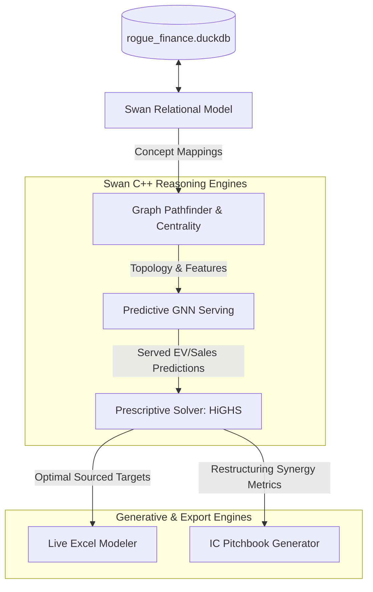

# Rebuilding the Rogo AI Analyst - Phase 3: Advanced Reasoning Modules

This document details the software design, mathematical formulations, and execution patterns for the **Advanced Reasoning Modules** in the rebuilt Rogo AI Analyst. Rather than using external wrappers (like NetworkX, raw PyTorch Geometric, or SciPy), we leverage **Swan's native C++ reasoning engines** (`pyrel_duckdb.reasoners`) to run graph algorithms, Graph Neural Networks (GNNs), and mathematical programming directly over our DuckDB data warehouse.

---

## 📐 System Flow Overview

All reasoning modules are built as declarative layers on top of the Swan semantic model:



---

## 🌐 1. Swan Graph Pathfinder & Contagion Simulator (`path_reasoner.py`)

This module implements value chain analysis, customer-vendor reachability, and corporate board interlocks using Swan's graph reasoning engines.

### A. Topology Construction
We instantiate a Swan `Graph` topology binding custom ontology concepts representing B2B linkages:

```python
from pyrel_duckdb.reasoners.graph import Graph

# Initialize the directed supply chain graph
supply_graph = Graph(
    model,
    directed=True,
    weighted=True,
    node_concept=Company,
    edge_concept=SupplierRelation, # supplies_to relationship mapping
    edge_src_relationship=SupplierRelation.supplier,
    edge_dst_relationship=SupplierRelation.customer,
    edge_weight_relationship=SupplierRelation.revenue_share
)
```

### B. Core Operations

#### 1. PageRank Distress Contagion (Use Case 12)
Detects central systemic nodes in the supply chain exposed to distress propagation. We invoke Swan's native PageRank:

```python
# Compute PageRank scores on the supplies graph
pagerank_scores = supply_graph.pagerank(
    damping_factor=0.85, 
    max_iter=20, 
    tolerance=1e-6
)

# Query PageRank nodes and extract to DataFrame
centrality_df = model.where(pagerank_scores).select(
    pagerank_scores["node"].id.alias("company_id"),
    pagerank_scores.score.alias("distress_influence")
).to_df()
```

#### 2. Downstream Reachability & WCC (Use Case 4 & 12)
Traces if a systemic vendor shock propagates down the supply chain to a specific customer node.
* **C++ Cache Optimization:** We pass `use_cache=True` to activate Swan's C++ transitive reachability caches (`TransitiveReachabilityCache`), bypassing expensive recursive SQL CTE processing.

```python
# Check reachability between two companies
reachable_rel = supply_graph.reachable(CompanyA, CompanyB, use_cache=True)
```

To partition the value-chain into isolated supplier clusters, we execute Weakly Connected Components:

```python
wcc_rel = supply_graph.weakly_connected_component(
    use_cache=True,
    cache_table="supplier_relation",
    cache_src="supplier_id",
    cache_tgt="customer_id"
)
```

#### 3. Board Interlock Detection (Use Case 14)
To detect interlocking directorship networks, a bipartite graph mapping `Person` nodes sitting on `Board` entities is constructed, allowing direct extraction of interlocking pathways:

```python
board_graph = Graph(
    model,
    directed=False,
    node_concept=Person,
    edge_concept=BoardMember,
    edge_src_relationship=BoardMember.director,
    edge_dst_relationship=BoardMember.company
)

# Extract degree centrality to locate high-degree directors
director_degrees = board_graph.degree(of=Person)
```

---

## 🤖 2. Swan Predictive GNN Servicer (`gnn_model.py`)

This module uses Swan's GNN predictive reasoning engine to forecast company valuation multiples (EV/Sales and EV/EBITDA) directly inside DuckDB.

### A. Feature Ingestion & Normalization (`PropertyTransformer`)
We define a property transformer to standardize categorical sectors, continuous financial ratios, and news sentiment headlines into tensor representations:

```python
from pyrel_duckdb.reasoners.predictive import PropertyTransformer

pt = PropertyTransformer(
    category=[Company.sector, Company.credit_rating],
    continuous=[
        Company.revenue, 
        Company.ebitda_margin, 
        Company.debt_to_equity, 
        Company.altman_z_score,
        Company.free_cash_flow_quality_ratio
    ],
    text=[Company.latest_headline] # Normalized via local sentence-transformers
)
```

### B. Inductive Sourcing for Private Targets (Use Case 2 & 13)
By utilizing Swan's Graph Neural Network architecture, we solve the **Private Target Valuation Problem**. Because private companies lack daily market pricing tickers (`data/ohlcv`), the GNN uses graph neighborhood message-passing to project valuation multiples:
1. The model aggregates the topological embeddings of public supply chain customers and competitors linked via `supplies_to`.
2. The `PropertyTransformer` propagates features across the bipartite graph, projecting public market valuation margins onto private nodes.

```python
from pyrel_duckdb.semantics.reasoners.predictive import GNN

# Define query splits: Train on public firms, validate, and predict on private targets
TrainQuery = select(Company.id, Company.target_multiple).where(Company.is_public == True)
ValQuery = select(Company.id, Company.target_multiple).where(Company.is_val == True)

# Build the GNN
gnn = GNN(
    graph=supply_graph,
    property_transformer=pt,
    train=TrainQuery,
    validation=ValQuery,
    task_type="regression", # Predict continuous multiples
    hidden_channels=16,
    n_epochs=50,
    lr=0.01
)

gnn.fit()
```

### C. Native In-Database Inference (C++ ONNX Runtime)
Serve GNN predictions natively inside DuckDB queries to bypass Python transfer overhead:

```python
# Serving predictions on target PE screening candidates
Company.predicted_multiples = gnn.predictions(domain=ScreeningTestQuery)

# Select GNN projections in-place
valuation_df = select(
    Company.id,
    Company.predicted_multiples.probs.alias("predicted_multiple")
).where(Company.predicted_multiples).to_df()
```

### D. Model Explainability Views
For investment diligence reporting (Use Case 10), we query Swan's C++ GNN explainability metrics (`ExplainNode` and `ExplainEdge`) to audit what features drove a specific valuation:

```python
ExplainNode, ExplainEdge = gnn.explain(target_id="AAPL", top_k=5)

# Query most important feature contributions
node_attributions = select(ExplainNode.node, ExplainNode.weight).to_df()
edge_attributions = select(ExplainEdge.src, ExplainEdge.dst, ExplainEdge.weight).to_df()
```

---

## 🎯 3. Swan Prescriptive Target Optimizer (`optimizer.py`)

This module uses Swan's prescriptive solver wrapper (`pyrel_duckdb.reasoners.prescriptive`) to compile Linear Programs (LP) and Mixed-Integer Programs (MIP) directly over the DuckDB engine, solving them using the local C++ **HiGHS** solver.

### A. Problem Context & Variable Declarations
We instantiate a prescriptive context and define binary variables indicating whether target firms are selected for acquisition:

```python
from pyrel_duckdb.reasoners.prescriptive import Problem, implies
from pyrel_duckdb.std import aggregates as aggs

problem = Problem(model, Float)

# Declare binary decision variables (populate=True writes output back to database)
x_acquire = problem.solve_for(Company.x_acquire, type="bin", populate=True)
```

### B. Objective Function (Incorporating LBO Tax Shields)
To mirror institutional PE deal scoring, the objective function maximizes the aggregate portfolio Net Income plus **M&M tax shield benefits** (interest deductibility offsets) generated by LBO leverage debt financing:

$$\max_x \sum_{i=1}^{N} x_i \times \left( \text{NetIncome}_i + \text{CEO\_Pay\_Synergies}_i + \text{Projected\_LBO\_Debt}_i \times \text{CostOfDebt}_i \times \text{EffectiveTaxRate}_i \right)$$

In code:

```python
problem.maximize(
    aggs.sum(
        Company.x_acquire * (
            Company.net_income_loss + 
            Company.ceo_compensation * 0.3 + 
            (Company.revenue * Company.predicted_multiples.probs * 0.60) * Company.cost_of_debt * Company.effective_tax_rate
        )
    )
)
```

### C. Constraints
Swan compiles these constraints directly into HiGHS matrices:

```python
# 1. Sourcing Quantity (Select exactly K targets)
problem.satisfy(aggs.sum(Company.x_acquire) == K)

# 2. Capital Allocation Limit (Total Cost <= Budget)
problem.satisfy(
    aggs.sum(Company.x_acquire * Company.predicted_multiples.probs * Company.revenue) <= Budget
)

# 3. Sector Concentration Constraints (Max 2 acquisitions per sector)
problem.satisfy(
    aggs.sum(Company.x_acquire).per(Company.sector) <= 2
)

# 4. Solvency Exclusion (Exclude Altman Distress candidates)
problem.satisfy(
    model.require(implies(Company.altman_z_score < 1.81, Company.x_acquire == 0))
)
```

---

## 📈 4. Structural Merton Default Risk Simulator (`merton_simulator.py`)

This module implements the **Merton Structural Credit Model** (Use Case 3, 5, & 12). Rather than using static ratings, we model corporate equity as a European call option on company assets.

### A. Non-Linear Asset Resolution
We solve the system of non-linear equations for asset value ($V_A$) and asset volatility ($\sigma_A$) given equity value ($V_E$), equity volatility ($\sigma_E$, extracted from daily `implied_volatility` metrics), total debt book value ($D$), risk-free rate ($r$), and maturity ($T=1$):

$$V_E = V_A N(d_1) - e^{-r T} D N(d_2)$$

$$\sigma_E = \left( \frac{V_A}{V_E} \right) N(d_1) \sigma_A$$

Where:

$$d_1 = \frac{\ln(V_A / D) + (r + \sigma_A^2 / 2)T}{\sigma_A \sqrt{T}}$$

$$d_2 = d_1 - \sigma_A \sqrt{T}$$

### B. Distance to Default (DD) and Probability of Default (PD)
Once solved, we compute the Distance to Default and map the risk rating:

$$\text{DistanceToDefault} = \frac{\ln(V_A / D) + (r - \sigma_A^2 / 2)T}{\sigma_A \sqrt{T}}$$

$$\text{ProbabilityOfDefault} = N(-\text{DistanceToDefault})$$

This probability is written back to the `BankruptcyRisk` concept to feed the Graph Contagion Pathfinder.

---

## 🌎 5. Macro Carry Trade & Hedging Solver (`macro_optimizer.py`)

For global macro treasury analysis (Use Case 15), we build an optimal currency carry optimizer inside Swan's prescriptive solver to find the optimal allocation weights ($w_j$) across international sovereign yield curves:

### A. Markowitz Objective Function
We declare continuous allocation variables for currencies ($w_j$, bound between $-1.0$ and $1.0$ to allow short positions) and minimize portfolio volatility while targeting a minimum carry return:

$$\min_w \sum_{j} \sum_{k} w_j w_k \text{Covariance}_{jk}$$

Subject to:

$$\sum_{j} w_j \times \text{NetCarryYield}_j \ge \text{TargetSpread}$$

$$\sum_{j} |w_j| \le 1.0 \quad \text{(Capital budget constraint)}$$

In Swan, the covariance factors are queried directly from daily `fx_rates` changes:

```python
carry_prob = Problem(model, Float)

# Solve for continuous currency weights
w_alloc = carry_prob.solve_for(Country.w_alloc, type="cont", lower=-1.0, upper=1.0)

# Add constraints and minimize currency volatility matrix sum
# carry_prob.minimize( ... )
```

---

## 📈 6. Live Formula Excel Modeler (`live_modeler.py`)

Generates living Excel spreadsheet outputs (Use Cases 11 & 13) using `openpyxl`.
* **Zero Hardcoding Rule:** Projection cells must refer to formula equations in uppercase string parameters (e.g. `=B2*0.60`) rather than injecting static float results.
* **Dependency Tree:** Traces inputs dynamically:

| Output Row | Cell Label | Excel Formula |
| :--- | :--- | :--- |
| **Row 2** | `Purchase Price` | `B2` (Base value sourced from GNN prediction) |
| **Row 3** | `Debt Contribution` | `=B2 * 0.60` (60% LBO Debt capacity) |
| **Row 4** | `Sponsor Equity` | `=B2 - B3` (Remaining Equity financing) |
| **Row 5** | `Year 1 Revenue` | `=PriorYearSales * (1 + GrowthRate)` |
| **Row 6** | `Year 1 EBITDA` | `=B5 * EBITDA_Margin` |
| **Row 7** | `Year 1 Debt Payment` | `=PMT(InterestRate, 5, -B3)` (Amortization schedule) |

---

## 🔗 7. Source Citation Engine (`citation_engine.py`)

Binds cell data in web grids and pitchbooks to row indexes inside DuckDB:

```json
{
  "citation_id": "CIT_SEC_2026_091",
  "symbol": "AAPL",
  "period": "FY2026",
  "concept": "operating_income_loss",
  "val": 114500000000.0,
  "source_table": "sec_financials_short_financials_df",
  "source_row_index": 9482,
  "sql_locator": "SELECT operating_income_loss FROM sec_financials_short_financials_df WHERE ticker='AAPL' AND fiscal_year=2026"
}
```

---

## 🧪 Phase 3 Verification Plan

The test suite `verify_reasoning.py` verifies the Swan solvers:
1. **Graph Pathfinder Isolation:** Verifies that reachability checks compile correctly and yield expected binary paths.
2. **GNN Serving check:** Asserts that predictions return valid float arrays via local ONNX runtime.
3. **MIP Convergence test:** Formulates a mock subset allocation and verifies that HiGHS returns the global optimum matching hand-computed bounds.
4. **Excel live formula check:** Validates that generated LBO sheets do not contain static numeric values in formula fields.