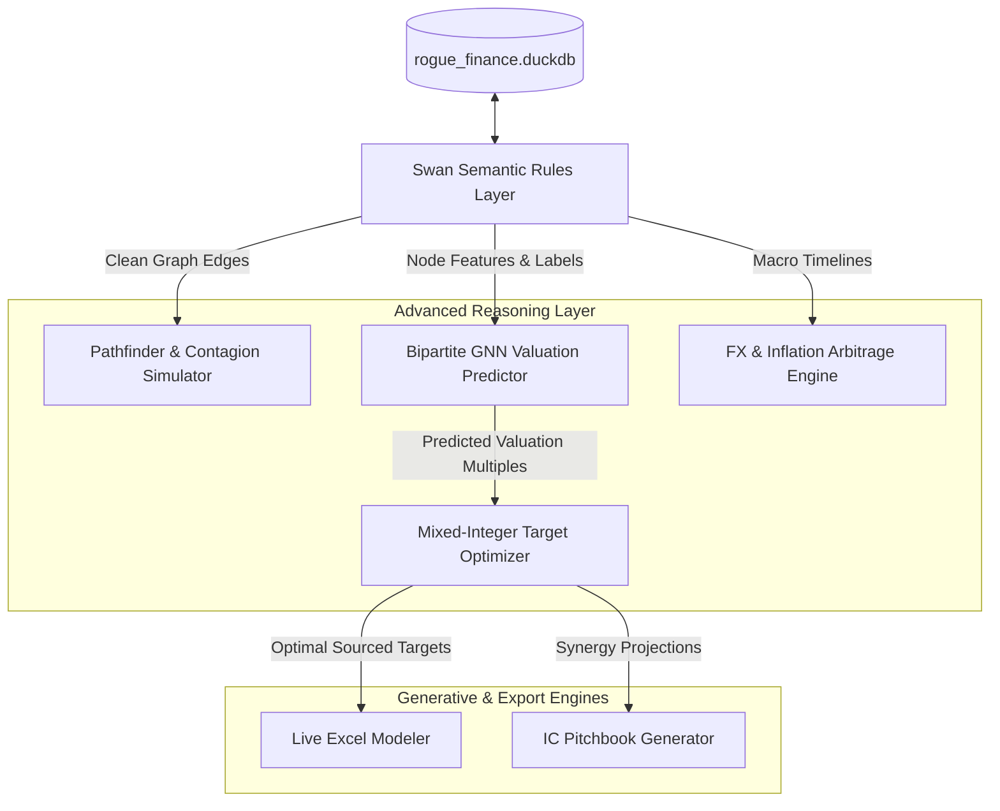

# Rebuilding the Rogo AI Analyst - Phase 3: Advanced Reasoning Modules

This document details the software design, mathematical formulations, and execution patterns for the **Advanced Reasoning Modules** in the rebuilt Rogo AI Analyst. These modules translate raw relational SQL and semantic data from the **DuckDB Warehouse** and **Swan Datalog Rules** into predictive intelligence, graph propagation models, and optimal decision support systems.

---

## 📐 System Flow Overview

The Advanced Reasoning Modules sit between the semantic data layer and Felix's client-facing query coordinator:



---

## 🌐 1. NetworkX Pathfinder & Contagion Simulator (`path_reasoner.py`)

This module implements structural graph algorithms to track B2B supply chain dependencies, NAICS sector contagion risk, and governance board interlocks.

### A. Graph Ingestion and Namespace Alignment
Data is loaded directly from DuckDB (`business_network_links`, `domain_partnerships`, `boardmembers`) into a NetworkX `DiGraph` representation.
* **Namespace Suffixing:** To avoid collision between identical domain names and corporate entity names, entities are registered as `name (Company)` or `name (Domain)`.
* **Edge Weights:** Sourced from `trade_credit` and `domain_partnerships` (e.g. transaction volumes, DSO days, or revenue exposure percentages).

### B. Mathematical Algorithms

#### 1. Distress Contagion Risk Score (PageRank Multiplier)
We compute a personalized PageRank over the supply chain network, where the personalization vector $v$ is biased by the company's financial distress probability ($Altman\ Z\text{-}Score$ or $BankruptcyRisk.probability$):

$$v_i = \max\left(0, \text{BankruptcyRisk.probability}_i \times \text{Leverage}_i\right)$$

The PageRank vector $x$ is solved iteratively:

$$x = d(W \cdot x) + (1-d)v$$

Where:
* $d = 0.85$ (damping factor).
* $W$ is the column-normalized transition matrix of B2B supply links.

#### 2. Downstream Credit write-off Propagation
For any distressed target company $C_{distressed}$, we trace downstream dependencies to estimate aggregate trade credit write-off exposures ($Loss_i$) for every supplier $i$ in a multi-hop traversal:

$$Loss_i = \sum_{h=1}^{H} \left( \gamma^h \times \prod_{e \in Path(i \to C_{distressed})} \text{RevenueShare}_e \times \text{DefaultProb}_{C_{distressed}} \times \frac{\text{DSO}_i}{365} \right)$$

Where:
* $H = 3$ (maximum contagion hop distance).
* $\gamma = 0.9$ (attenuation factor per hop).
* $\text{DSO}_i$ is the supplier's average Days Sales Outstanding from `trade_credit`.

#### 3. Board Interlock Detection
Identifies cliques and paths across interlocking directors to detect potential pathways for information migration:

```python
import networkx as nx

def detect_governance_cliques(G_board):
    # Find all interlocking board cliques larger than 2 members
    cliques = list(nx.enumerate_all_cliques(G_board.to_undirected()))
    interlocked = [c for c in cliques if len(c) > 2]
    return interlocked
```

---

## 🤖 2. Bipartite GNN Valuation Predictor (`gnn_model.py`)

This module builds a heterogeneous GNN using PyTorch Geometric (PyG) to predict target firm valuation multiples (EV/Sales and EV/EBITDA) by merging relational company metrics with investment networks.

### A. Graph Data Schema (`HeteroData`)
* **Node Types:**
  * `company`: Features = `[Revenue, EBITDA_Margin, Debt_to_Equity, Altman_Z, CEO_Salary_Ratio, Piotroski_F_Score, ESG_Score]`. Dimension: $F_c = 7$.
  * `investor`: Features = `[Total_AUM, Institutional_Weight, Turnover_Rate]`. Dimension: $F_i = 3$.
* **Edge Types:**
  * `(company, supplies_to, company)`
  * `(investor, holds, company)`: Edge attribute = `[Shares_Held, Value_USD]`.

### B. Heterogeneous Convolution Architecture
A two-layer Heterogeneous Graph Attention Network (`HANConv`) or GraphSAGE variant compiles features:

```python
import torch
import torch.nn as nn
from torch_geometric.nn import HeteroConv, SAGEConv, GATConv

class HeteroValuationGNN(nn.Module):
    def __init__(self, metadata, hidden_channels, out_channels):
        super().__init__()
        # First Heterogeneous Layer
        self.conv1 = HeteroConv({
            ('company', 'supplies_to', 'company'): SAGEConv((-1, -1), hidden_channels),
            ('investor', 'holds', 'company'): GATConv((-1, -1), hidden_channels, heads=2, concat=False),
        }, agg='sum')
        
        # Second Heterogeneous Layer
        self.conv2 = HeteroConv({
            ('company', 'supplies_to', 'company'): SAGEConv((-1, -1), hidden_channels),
            ('investor', 'holds', 'company'): SAGEConv((-1, -1), hidden_channels),
        }, agg='sum')
        
        # Output Projection MLP
        self.fc = nn.Sequential(
            nn.Linear(hidden_channels, 32),
            nn.ReLU(),
            nn.Linear(32, out_channels) # Out maps to EV/Sales or EV/EBITDA multiples
        )

    def forward(self, x_dict, edge_index_dict):
        # Layer 1
        x_dict = self.conv1(x_dict, edge_index_dict)
        x_dict = {key: torch.relu(x) for key, x in x_dict.items()}
        
        # Layer 2
        x_dict = self.conv2(x_dict, edge_index_dict)
        x_dict = {key: torch.relu(x) for key, x in x_dict.items()}
        
        # Output multiple for companies
        return self.fc(x_dict['company'])
```

### C. Constraint-Satisfaction Loss (Łukasiewicz soft-logic loss)
To ensure the predicted valuation multiples do not violate physical bounds (e.g. ensuring a company's predicted EV is higher than its net cash, or enforcing sector-level bounds derived from ratings thresholds), we implement a hybrid loss function:

$$\mathcal{L} = \mathcal{L}_{MSE} + \lambda_1 \mathcal{L}_{lower\_bound} + \lambda_2 \mathcal{L}_{upper\_bound}$$

Where the logic bounds are defined as soft penalties:

$$\mathcal{L}_{lower\_bound} = \sum_{j} \max\left(0, \text{NetDebt}_j - (\hat{y}_j \times \text{Sales}_j) \right)^2$$

$$\mathcal{L}_{upper\_bound} = \sum_{j} \max\left(0, (\hat{y}_j - \text{MaxSectorMultiple}_{\text{rating}}) \times \text{Sales}_j \right)^2$$

---

## 🎯 3. SciPy Mixed-Integer Target Optimizer (`optimizer.py`)

This module executes optimal PE acquisition/LBO sourcing targets selection. It identifies the optimal subset of companies to acquire under fixed capital budgets.

### A. Decision Variables
Let $x_i \in \{0, 1\}$ be the binary decision variable indicating whether target company $i$ is selected for acquisition.

### B. Mathematical Formulation

#### 1. Objective Function
Maximize the aggregate projected Net Income of the acquired portfolio, factoring in expected post-restructuring overhead synergies (e.g., cutting bloated executive overhead sourced from `ceo_salaries`):

$$\max_x \sum_{i=1}^{N} x_i \times \left( \text{NetIncome}_i + \text{CEO\_Pay}_i \times \left(1 - \frac{1}{\text{IndustryAveragePayRatio}}\right) \right)$$

#### 2. Constraints

* **Capital Budget Constraint:**
  The total purchase price (derived from predicted GNN multiples) must not exceed our maximum allocation budget $B$:

$$\sum_{i=1}^{N} x_i \times \left( \text{Predicted\_Multiple}_i \times \text{Sales}_i \right) \le B$$

* **Target Acquisition Count:**
  Select exactly $K$ targets:

$$\sum_{i=1}^{N} x_i = K$$

* **Sector Diversity Restriction:**
  To prevent sector concentration risk, limit the number of acquisitions in any sector $s$ to $M_s$:

$$\sum_{i \in \text{Sector}_s} x_i \le M_s \quad \forall s$$

* **Risk-Zone Exclusions (Hard Constraints):**
  A target cannot be selected if it is classified in the Altman Z-score distress zone or has active patent litigation:

$$x_i = 0 \quad \forall i \in \{j \mid \text{AltmanZ}_j < 1.81 \text{ or defendant\_status}_j = \text{True}\}$$

### C. SciPy MILP Solver Ingestion
The variables are passed to `scipy.optimize.milp` using a linear constraint matrix formulation:

```python
import numpy as np
from scipy.optimize import milp, Bounds, LinearConstraint

def solve_lbo_selection(net_incomes, costs, sector_matrix, max_sectors, K, risk_flags):
    num_vars = len(net_incomes)
    
    # 1. Objective Vector (Minimize negative income to maximize)
    c = -np.array(net_incomes)
    
    # 2. Variable Bounds (Binary: 0 or 1)
    bounds = Bounds(np.zeros(num_vars), np.ones(num_vars))
    integrality = np.ones(num_vars) # 1 indicates integer constraint
    
    # 3. Capital Cost Constraint (Cost <= Budget)
    # A_ub cost matrix bounds
    # 4. Count Constraint (Sum == K)
    # 5. Risk exclusions (Hard bounds set to 0)
    # 6. Sector limits
    
    # Execute solver
    # res = milp(c=c, integrality=integrality, bounds=bounds, constraints=constraints)
    # return res.x
```

---

## 📈 4. Live Formula Excel Modeler (`live_modeler.py`)

This engine implements the dynamic spreadsheet generation requirements (Use Case 11 & 13) using `openpyxl`.
* **Zero Hardcoding Rule:** Financial projection worksheets must write formulas in uppercase cell references instead of static computed float lines.
* **Dependency Tree:** Traces baseline inputs to construct projection columns:

| Output Row | Cell Label | Excel Formula |
| :--- | :--- | :--- |
| **Row 2** | `Purchase Price` | `$1,000,000,000` (Hardcoded input parameter) |
| **Row 3** | `Debt Contribution` | `=B2 * 0.60` (60% LBO Debt capacity) |
| **Row 4** | `Sponsor Equity` | `=B2 - B3` (Remaining Equity financing) |
| **Row 5** | `Year 1 Revenue` | `=PriorYearSales * (1 + GrowthRate)` |
| **Row 6** | `Year 1 EBITDA` | `=B5 * EBITDA_Margin` |
| **Row 7** | `Year 1 Debt Payment` | `=PMT(InterestRate, 5, -B3)` (Amortization schedule) |

---

## 🔗 5. Source Citation Engine (`citation_engine.py`)

To ensure absolute auditability (Use Case 10 & 11), any derived fact presented in the web UI or generated IC pitchbooks must link back to its exact database origin in `rogue_finance.duckdb`.

### A. Traceability Metadata
The engine maintains a citation registry index mapping extracted variables to a standard locator schema:

```json
{
  "citation_id": "CIT_SEC_2026_091",
  "symbol": "AAPL",
  "period": "FY2026",
  "concept": "operating_income_loss",
  "val": 114500000000.0,
  "source_table": "sec_financials_short_financials_df",
  "source_row_index": 9482,
  "sql_locator": "SELECT operating_income_loss FROM sec_financials_short_financials_df WHERE ticker='AAPL' AND fiscal_year=2026"
}
```

### B. User Citation Rendering
In reports or memos, citations are injected as superscript tags: `Apple achieved operating profits of $114.5B [1]`. The index mapping maps `[1]` directly to the `sql_locator` query, allowing one-click database audits.

---

## 🌍 6. Macro Hedging & Sovereign Rating Simulator (`macro_simulator.py`)

This module simulates Purchasing Power Parity (PPP) adjustments and carry trade exposures across national borders (Use Case 15).

### A. Purchasing Power Parity (PPP) Valuation Gaps
We calculate the PPP spot rate differential over a year horizon:

$$\text{FX\_PPP}_{t} = \text{FX\_Spot}_{t-1} \times \left( \frac{1 + \text{Inflation}_{\text{Country B}}}{1 + \text{Inflation}_{\text{Country A}}} \right)$$

If $\text{FX\_Spot}_t > \text{FX\_PPP}_t$, the currency is flagged as overvalued.

### B. Carry Trade Arbitrage Yields
Estimates the net carry spread adjusting for sovereign credit risk and inflation differentials:

$$\text{Net Carry Yield} = \left(\text{Rate}_{\text{Local}} - \text{Rate}_{\text{Fed}}\right) - \left( \text{SovereignSpread}_{\text{Local}} + \text{PPP\_Gap} \right)$$

If the net carry yield remains above a threshold (e.g. 200 bps), the simulator triggers a carry trade allocation model.

---

## 🧪 Phase 2 & 3 Verification Plan

The test runner `verify_reasoning.py` executes these validation pipelines:
1. **Pathfinder Isolation:** Checks that PageRank scores match pre-calculated metrics on sample graphs.
2. **GNN Output Bounds:** Runs test input through `HeteroValuationGNN` and asserts that loss penalties are non-zero if output exceeds rating sector caps.
3. **MILP Optimality check:** Runs a mock sourcing problem with known optimal solution and checks that the SciPy MILP output selects the correct target nodes.
4. **Excel live formula parser:** Checks generated spreadsheet worksheets to assert that no raw numbers exist in formula cells.