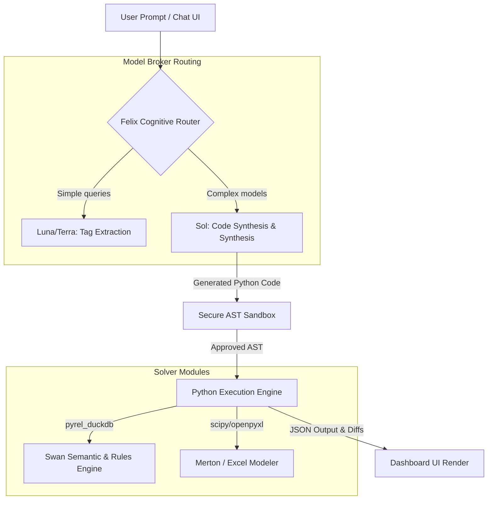

# Rebuilding the Rogo AI Analyst - Phase 4: Felix Agent Coordinator & Playbook Orchestrator

This document details the software design, routing mechanics, sandboxed execution rules, and playbook integration schemes for the **Felix Agent Coordinator** (`agent_pipeline.py`). Felix coordinates incoming user questions, compiles them into executable Swan and Python pipelines, enforces security sandboxing, and synthesizes output deliverables for all **24 financial due diligence use cases**.

---

## 📐 1. Felix Coordinator Architecture

Felix acts as the central cognitive router. It bridges the natural language interface (Chat UI) with the local reasoning solvers:



---

## 🔒 2. Secure AST Python Sandbox (`sandbox.py`)

To prevent arbitrary execution risks (XSS, remote code execution, database corruption), all generated Python blocks are checked using an Abstract Syntax Tree (AST) validator before execution.

### A. Deny-List and Allow-List Checks
The validator audits the code's parsed nodes against a whitelist:
* **Approved Modules:** `pyrel_duckdb`, `pandas`, `numpy`, `openpyxl`, `json`, `math`, `datetime`, `scipy.optimize.milp`, `scipy.optimize.Bounds`.
* **Prohibited Imports:** `os`, `sys`, `shutil`, `subprocess`, `requests`, `urllib`, `socket`, `builtins.eval`, `builtins.exec`, `sqlite3`, `duckdb` (raw connections bypassed; only Swan `Model` references allowed).

### B. Validation Code Skeleton
```python
import ast

class SecureASTValidator(ast.NodeVisitor):
    def __init__(self):
        self.allowed_imports = {'pandas', 'numpy', 'openpyxl', 'pyrel_duckdb', 'json', 'math', 'datetime', 'scipy'}
        
    def visit_Import(self, node):
        for alias in node.names:
            base_module = alias.name.split('.')[0]
            if base_module not in self.allowed_imports:
                raise PermissionError(f"AST Error: Import of '{alias.name}' is prohibited in the sandbox.")
        self.generic_visit(node)

    def visit_ImportFrom(self, node):
        base_module = node.module.split('.')[0]
        if base_module not in self.allowed_imports:
            raise PermissionError(f"AST Error: Import from '{node.module}' is prohibited in the sandbox.")
        self.generic_visit(node)

    def visit_Call(self, node):
        # Prevent calls to built-in eval/exec or open
        if isinstance(node.func, ast.Name):
            if node.func.id in {'eval', 'exec', 'open', 'compile'}:
                raise PermissionError(f"AST Error: Call to built-in function '{node.func.id}' is prohibited.")
        self.generic_visit(node)
```

---

## 💼 3. The Playbook Orchestrator (Solving the 24 Use Cases)

Felix compiles incoming queries into specific playbook pipelines, querying the DuckDB/Swan layer and outputting target spreadsheets, IC memos, or graph visualizations:

### 1. Earnings Comp & Consensus Analysis
* *Pipeline:* Joins `earnings_estimates` with daily `ohlcv` price series matching filing dates. Calculates post-release stock price drift.
* *Output:* Markdown table comparing actual EPS vs. analyst consensus estimates paired with 5-day post-earnings volatility.

### 2. Public & Private Company Sourcing & Screening
* *Pipeline:* Filters private VC companies in `startup_vc` and correlates them with overlapping board member seats in `board_members`.
* *Output:* Network graph of co-directorship networks linking PE acquirers to startup founders.

### 3. Credit Analysis & Debt Due Diligence
* *Pipeline:* Matches corporate bonds coupons in `corporate_bonds` with issuer rating histories in `corporate_credit_ratings`.
* *Output:* Maturity wall timeline chart grouping debt structures by credit quality grade.

### 4. Supply Chain Contagion & Macro Exposure
* *Pipeline:* Joins `business_network_links` with daily commodity spot prices to trace cost exposure paths.
* *Output:* Direct risk allocation list mapping supplier cost shocks directly to customer cost of goods sold (COGS).

### 5. Distress & Layoff Monitoring
* *Pipeline:* Aggregates monthly layoff timelines in `corporate_layoffs` and correlates them with default probabilities in `bankruptcy_risk`.
* *Output:* Historical distress volatility charts plotted against headcount reductions.

### 6. Broker Research & Ratings Synthesis
* *Pipeline:* Runs sentiment parsing on headlines in `financial_news` and aggregates rating updates (upgrades/downgrades).
* *Output:* Consensus recommendation distribution tracker (Buy/Hold/Sell) with sentiment weight overlays.

### 7. Generative Grid & Multi-Document Comparison
* *Pipeline:* Compiles comparative balance sheets and income metrics across targeted peer ticker symbols.
* *Output:* Side-by-side comparative table (Generative Grid) detailing margins, leverage, and cash conversion cycles.

### 8. Virtual Data Room (VDR) & M&A Covenant Diligence
* *Pipeline:* Scans patent litigation histories in `patent_litigation` and joins target debt terms.
* *Output:* Covenant diligence dashboard highlighting change-of-control risks or outstanding litigation damages.

### 9. Public Equity Valuation Multiples Comps Generator
* *Pipeline:* Pulls daily capitalization weights from `ohlcv` and divides by fundamentals margins (sales, EBITDA).
* *Output:* Trading multiples peer comparables table (P/E, EV/Sales, EV/EBITDA).

### 10. IC Memo & Pitchbook Generator
* *Pipeline:* Aggregates transaction metadata from `mergers_acquisitions` and formats target income sheets with direct filing citations.
* *Output:* Dowloandable Word/PDF Investment Committee Memo pre-populated with citation tags.

### 11. Auditable Live-Formula Excel Modeler
* *Pipeline:* Scribes fundamental variables into an OpenPyXL workbook context.
* *Output:* Downloadable `.xlsx` sheet built using cell-to-cell math formulas (`=SUM(B2:B5)`) instead of hardcoded numbers.

### 12. Restructuring & Supplier Contagion Simulator
* *Pipeline:* Shock-refinances upcoming bond maturities at current yield spreads, propagating distress down the supplies graph.
* *Output:* Systemic contagion report mapping write-off risk dollar impacts for downstream suppliers.

### 13. Autonomous PE/LBO Deal Hunter & Valuator
* *Pipeline:* Filters low-multiple firms, excludes litigation defendants, optimizes synergy targets using HiGHS, and constructs debt payback models.
* *Output:* Full LBO target sourcing pitch deck paired with an Excel debt model.

### 14. Insider Trading & Governance Tracker
* *Pipeline:* Traces large executive transactions occurring within 30 days before scheduled earnings releases or clinical results.
* *Output:* Compliance alert register flagging quiet-window trades.

### 15. Cross-Border FX & Inflation Arbitrage Simulator
* *Pipeline:* Maps CPI curves to spot exchange rates, modeling Purchasing Power Parity gaps and carry trade spreads.
* *Output:* Carry trade allocation spreadsheet showing risk-adjusted spreads across sovereign curves.

### 16. Federal Contracting Backlog & Revenue Shock Simulator
* *Pipeline:* Projects contract roll-off curves and applies backlog decay shocks to target firm valuations.
* *Output:* Revenue backlog decay charts showing projected funding shock impacts.

### 17. ESG Capital Flight & Controversy Valuation Discount Engine
* *Pipeline:* Merges controversy spikes with institutional holdings weightings to compute lp divestment probability.
* *Output:* Target discount report adjusting GNN multiple valuations.

### 18. Biotech Binary Clinical Trial Jump Simulator
* *Pipeline:* Maps pipeline trial indicators to disease burdens, simulating binary approval jump returns.
* *Output:* Decision-tree valuation projection comparing drug approval margins to liquidation thresholds.

### 19. Aviation Fleet Disruption & Route Capacity Optimizer
* *Pipeline:* Models passenger load factors adjusted for safety incident shocks and delivery delays.
* *Output:* Route margin degradation report projecting cost-per-passenger increases.

### 20. Semiconductor Fab Capacity & Export Control Restriction Simulator
* *Pipeline:* Restricts fab utilization capacities based on geopolitical export control entity listings.
* *Output:* Customer revenue leakage table mapping restricted shipment nodes.

### 21. Executive Pay-for-Performance & TSR Alignment Elasticity Solver
* *Pipeline:* Calculates TSR-Compensation elasticity ratios to source misaligned boards.
* *Output:* Corporate governance target list sorting boards by pay performance discrepancy.

### 22. Supply Chain Holding Cost & Inflation Squeeze Model
* *Pipeline:* Shocks holding cost factors using WACC and national CPI across supplier networks.
* *Output:* Gross margin degradation schedule for targeted LBO targets.

### 23. Startup Liquidity Runway & VC Down-Round Predictor
* *Pipeline:* Projects monthly burn rates and runway to calculate down-round refinancing probabilities.
* *Output:* Late-stage venture screening table highlighting motivated startup sellers.

### 24. Corporate Input Commodity Hedging Solver
* *Pipeline:* Solves prescriptive futures contracts hedging allocations to minimize input procurement costs variance.
* *Output:* Hedging schedule detailing optimal commodity cover ratios under budget bounds.

---

## 🧪 Phase 4 Verification Plan

The test runner `verify_coordinator.py` executes these validation checks:
1. **Sandbox Prohibitions:** Verifies that importing `os` or calling `eval` triggers a `PermissionError` inside the AST sandbox.
2. **Playbook Compilation:** Simulates user prompts for each of the 24 use cases and asserts that Felix builds the correct PyRel/SQL execution queries.
3. **Model Broker Routing:** Verifies that simple query strings compile using Luna, while complex optimization prompts route to Sol.