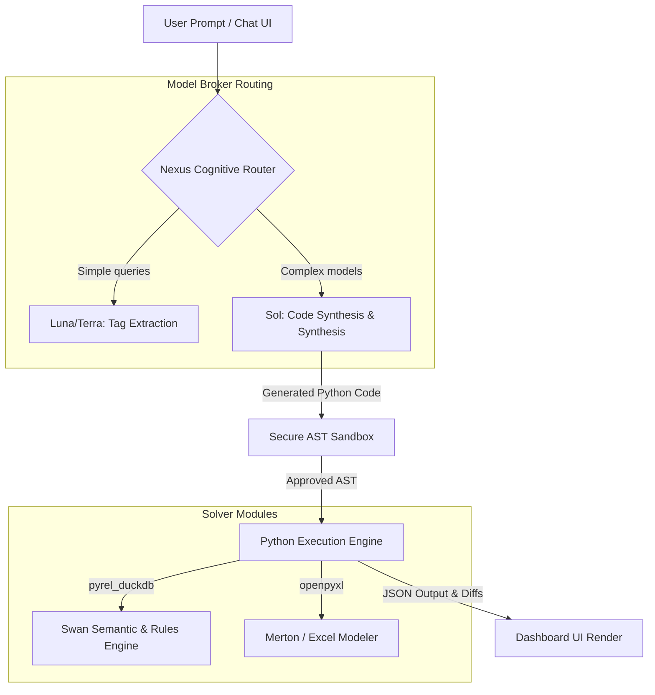

# Rebuilding the Rogo AI Analyst - Phase 4: Nexus Agent Coordinator & Playbook Orchestrator

This document details the software design, routing mechanics, sandboxed execution rules, and playbook integration schemes for the **Nexus Agent Coordinator** (`agent_pipeline.py`). Nexus coordinates incoming user questions, compiles them into executable Swan and Python pipelines, enforces security sandboxing, and synthesizes output deliverables for all **24 financial due diligence use cases**.

---

## 📐 1. Nexus Coordinator Architecture

Nexus acts as the central cognitive router. It bridges the natural language interface (Chat UI) with the local reasoning solvers:



---

## 🔒 2. Secure AST Python Sandbox (`sandbox.py`)

To prevent arbitrary execution risks (XSS, remote code execution, database corruption), all generated Python blocks are checked using an Abstract Syntax Tree (AST) validator before execution.

### A. Deny-List and Allow-List Checks
The validator audits the code's parsed nodes against a whitelist:
* **Approved Modules:** `pyrel_duckdb`, `pandas`, `numpy`, `openpyxl`, `json`, `math`, `datetime`.
* **Prohibited Imports:** `os`, `sys`, `shutil`, `subprocess`, `requests`, `urllib`, `socket`, `builtins.eval`, `builtins.exec`, `sqlite3`, `duckdb` (raw connections bypassed; only Swan `Model` references allowed).

### B. Validation Code Skeleton
```python
import ast

class SecureASTValidator(ast.NodeVisitor):
    def __init__(self):
        self.allowed_imports = {'pandas', 'numpy', 'openpyxl', 'pyrel_duckdb', 'json', 'math', 'datetime'}
        
    def visit_Import(self, node):
        for alias in node.names:
            base_module = alias.name.split('.')[0]
            if base_module not in self.allowed_imports:
                raise PermissionError(f"AST Error: Import of '{alias.name}' is prohibited in the sandbox.")
        self.generic_visit(node)

    def visit_ImportFrom(self, node):
        base_module = node.module.split('.')[0]
        if base_module not in self.allowed_imports:
            raise PermissionError(f"AST Error: Import from '{node.module}' is prohibited in the sandbox.")
        self.generic_visit(node)

    def visit_Call(self, node):
        # Prevent calls to built-in eval/exec or open
        if isinstance(node.func, ast.Name):
            if node.func.id in {'eval', 'exec', 'open', 'compile'}:
                raise PermissionError(f"AST Error: Call to built-in function '{node.func.id}' is prohibited.")
        self.generic_visit(node)
```

---

## 💼 3. The Playbook Orchestrator (Solving the 24 Use Cases)

Nexus compiles incoming queries into specific playbook pipelines, querying the DuckDB/Swan layer and outputting target spreadsheets, IC memos, or graph visualizations. The playbooks are categorized and structured below:

### 1. Earnings Comp & Consensus Analysis
* *Pipeline:* Joins `earnings_estimates` with daily `ohlcv` price series matching filing dates. Calculates post-release stock price drift.
* *Output:* Markdown table comparing actual EPS vs. analyst consensus estimates paired with 5-day post-earnings volatility.

### 2. Public & Private Company Sourcing & Screening
* *Pipeline:* Filters private VC companies in `startup_vc` and correlates them with overlapping board member seats in `board_members`.
* *Output:* Network graph of co-directorship networks linking PE acquirers to startup founders.

### 3. Credit Analysis & Debt Due Diligence
* *Pipeline:* Matches corporate bonds coupons in `corporate_bonds` with issuer rating histories in `corporate_credit_ratings`.
* *Output:* Maturity wall timeline chart grouping debt structures by credit quality grade.

### 4. Supply Chain Contagion & Macro Exposure
* *Pipeline:* Joins `business_network_links` with daily commodity spot prices to trace cost exposure paths.
* *Output:* Direct risk allocation list mapping supplier cost shocks directly to customer cost of goods sold (COGS).

### 5. Distress & Layoff Monitoring
* *Pipeline:* Aggregates monthly layoff timelines in `corporate_layoffs` and correlates them with default probabilities in `bankruptcy_risk`.
* *Output:* Historical distress volatility charts plotted against headcount reductions.

### 6. Broker Research & Ratings Synthesis
* *Pipeline:* Runs sentiment parsing on headlines in `financial_news` and aggregates rating updates (upgrades/downgrades).
* *Output:* Consensus recommendation distribution tracker (Buy/Hold/Sell) with sentiment weight overlays.

### 7. Generative Grid & Multi-Document Comparison
* *Pipeline:* Compiles comparative balance sheets and income metrics across targeted peer ticker symbols.
* *Output:* Side-by-side comparative table (Generative Grid) detailing margins, leverage, and cash conversion cycles.

### 8. Virtual Data Room (VDR) & M&A Covenant Diligence
* *Pipeline:* Scans patent litigation histories in `patent_litigation` and joins target debt terms.
* *Output:* Covenant diligence dashboard highlighting change-of-control risks or outstanding litigation damages.

### 9. Public Equity Valuation Multiples Comps Generator
* *Pipeline:* Pulls daily capitalization weights from `ohlcv` and divides by fundamentals margins (sales, EBITDA).
* *Output:* Trading multiples peer comparables table (P/E, EV/Sales, EV/EBITDA).

### 10. IC Memo & Pitchbook Generator
* *Pipeline:* Aggregates transaction metadata from `mergers_acquisitions` and formats target income sheets with direct filing citations.
* *Output:* Downloadable Word/PDF Investment Committee Memo pre-populated with citation tags.

### 11. Auditable Live-Formula Excel Modeler
* *Pipeline:* Scribes fundamental variables into an OpenPyXL workbook context.
* *Output:* Downloadable `.xlsx` sheet built using cell-to-cell math formulas (`=SUM(B2:B5)`) instead of hardcoded numbers.

---

### 🔮 12. Restructuring & Supplier Contagion Simulator
* **Business Case & Rationale:**
  A credit default or restructuring event at a major corporate node (e.g., Apple, Boeing) can trigger systemic insolvency across its entire supplier base. Credit officers and distressed debt analysts need to stress-test this contagion risk to avoid cascading trade-credit losses.
* **Pipeline Mechanics:**
  1. Identifies spec-grade bonds with upcoming maturity walls (`corporate_bonds`).
  2. Queries the B2B supplies graph (`business_network_links`) to locate all supplier connections.
  3. Projects multi-hop supplier losses based on target default probabilities and supplier Days Sales Outstanding (DSO) metrics in `trade_credit`.
* **Output:**
  An interactive Cytoscape network graph highlighting distressed source nodes and color-coding suppliers by projected credit loss exposure (low, medium, critical).

### 🤖 13. Autonomous PE/LBO Target Deal Sourcing
* **Business Case & Rationale:**
  Private equity associates spend hundreds of hours manually screening databases for leveraged buyout candidates. This playbook automates deal sourcing by locating undervalued target firms with optimized post-restructuring cash flows.
* **Pipeline Mechanics:**
  1. Screens target companies with low EV/Sales and EV/EBITDA multiples.
  2. Filters out active patent litigation defendants (`patent_litigation`).
  3. Employs Swan's prescriptive solver to select the optimal portfolio of targets that maximizes projected net income under fixed budget limits.
* **Output:**
  A downloadable OpenPyXL spreadsheet detailing a 5-year debt paydown amortization schedule and projected equity returns (IRR) with cell-level referencing formulas.

### 🕵️ 14. Insider Trading & Governance Audit
* **Business Case & Rationale:**
  Hedge funds and compliance officers look for corporate governance red flags, such as executive panic-selling shortly before bad news (earnings misses, rating downgrades, product delays).
* **Pipeline Mechanics:**
  1. Matches executive transactions in `insider_trading` with upcoming consensus earnings announcement dates in `earnings_estimates`.
  2. Traces interlocking directors across peer boards using Swan Graph reachability pathfinders to identify potential information leakage routes.
* **Output:**
  A compliance dashboard registry flagging trades executed in quiet-windows, rated by a Bayesian leakage probability score.

### 🌍 15. Cross-Border FX Carry Trade & Arbitrage Simulator
* **Business Case & Rationale:**
  Macro hedge funds leverage divergence in sovereign yield curves, inflation, and currency pairings to structure FX carry trades while hedging currency downside.
* **Pipeline Mechanics:**
  1. Correlates national CPI curves (`global_inflation`) with currency spot rates in `fx_rates`.
  2. Computes Purchasing Power Parity (PPP) differentials to flag overvalued currencies.
  3. Executes Swan's prescriptive solver to find optimal allocation weights ($w_j$) across international yield curves that minimize portfolio volatility under minimum spread targets.
* **Output:**
  An asset allocation table detailing target currency weights, hedged risk ratios, and sovereign credit default protection spreads.

### 🏛️ 16. Federal Contracting Backlog & Revenue Shock Simulator
* **Business Case & Rationale:**
  Defense and government-tech contractors depend heavily on federal agency funding. A budget freeze or government shutdown can cause immediate cash flow shocks. Equity analysts need to stress-test contract backlog decay curves.
* **Pipeline Mechanics:**
  1. Compiles contract start dates, values, and durations from `federal_contracts`.
  2. Computes the contract backlog roll-off curve:
     $$\text{Backlog}_{t} = \sum \text{AwardAmount} \times (1 - \text{ElapsedTime}/\text{Duration})$$
  3. Projects operating margin contraction if pending awards are delayed.
* **Output:**
  A line chart plotting contract backlog roll-off timelines and valuation multiple adjustments.

### 🍃 17. ESG Capital Flight & Controversy Discount Engine
* **Business Case & Rationale:**
  Institutional LPs frequently enforce strict ESG exclusion mandates. A major controversy spike can trigger rapid capital divestment, compressing a target's valuation multiple. Buy-side PMs need to quantify this valuation penalty.
* **Pipeline Mechanics:**
  1. Merges controversy ratings in `esg_ratings` with institutional holdings in `insider_trading`.
  2. Projects LP divestment probabilities ($P_{flight}$) based on controversy severity and institutional weights.
  3. Adjusts the GNN's predicted EV/Sales multiples downward.
* **Output:**
  A valuation multiple discount matrix showing the GNN valuation adjusted for LP capital flight risk.

### 🧬 18. Biotech Binary Clinical Trial Valuation Jump Simulator
* **Business Case & Rationale:**
  Venture capital and biotech equity investors face binary risk profiles when clinical trials are released. This model maps candidate pipeline probability curves to project post-event equity jumps.
* **Pipeline Mechanics:**
  1. Traces clinical trial stages in `pharma_trials` and maps indications to disease global case sizes in `disease_burden`.
  2. Compiles historical trial success rates by phase to estimate the approval probability ($P_{success}$).
  3. Simulates expected post-event equity values compared to liquidation boundaries.
* **Output:**
  A decision-tree scenario matrix detailing risk-adjusted valuations and NPV curves under trial success vs. fail scenarios.

### ✈️ 19. Aviation Fleet Disruption & Route Capacity Optimizer
* **Business Case & Rationale:**
  Airlines face margin squeeze when aircraft orders are delayed or safety incidents occur, dragging down route capacity. Sector analysts need to stress-test these operational parameters.
* **Pipeline Mechanics:**
  1. Traces fleet orders and delivery schedules in `aviation_industry/fleet_orders`.
  2. Adjusts passenger load factors based on safety incident fatalities and delivery delays.
  3. Projects route-by-route operating margin degradation.
* **Output:**
  A comparable route capacity table displaying load factor shocks and expected operational cost-per-passenger increases.

### 🔌 20. Semiconductor Fab Capacity & Export Control Simulator
* **Business Case & Rationale:**
  Geopolitical export controls directly impact semiconductor chipmakers by blocking sales to specific regions or entity lists. Analysts need to calculate customer-level revenue blockages and fab capacity write-downs.
* **Pipeline Mechanics:**
  1. Maps fab sizes and locations in `semiconductor_industry/fab_capacity`.
  2. Flags sales blockages to restricted clients linked via export controls.
  3. Restricts fab utilization capacities dynamically inside Swan Datalog rules.
* **Output:**
  A global trade risk map detailing customer revenue blockages and unutilized fab capacity costs.

### ⚖️ 21. Executive Pay-for-Performance & TSR Alignment Solver
* **Business Case & Rationale:**
  Activist hedge funds look for corporate governance targets where board members approve massive executive pay packages despite declining total shareholder returns (TSR).
* **Pipeline Mechanics:**
  1. Compiles CEO compensation in `ceo_salaries` and daily price series in `ohlcv`.
  2. Calculates the TSR-Compensation elasticity ratio ($\epsilon_{pay}$).
  3. Scores and ranks targets where compensation growth diverges from shareholder returns.
* **Output:**
  An activist sourcing dashboard listing governance targets sorted by pay-for-performance mismatch.

### 🌀 22. Supply Chain Holding Cost & Inflation Squeeze Model
* **Business Case & Rationale:**
  Macroeconomic inflation and rising interest rates squeeze supplier margins by increasing the carrying costs of raw materials and inventory. Corporate treasurers use this model to hedge working capital lines.
* **Pipeline Mechanics:**
  1. Queries B2B supply links and trade credit DSO terms in `trade_credit`.
  2. Shocks supplier inventory holding costs based on local CPI inflation and WACC rates.
  3. Projects gross operating margin contraction.
* **Output:**
  A margin sensitivity table detailing how inflation shocks compress gross profits across high-DSO sectors.

### 💸 23. Startup Liquidity Runway & VC Down-Round Predictor
* **Business Case & Rationale:**
  Late-stage secondary market buyers and PE funds look for cash-strapped private startups facing upcoming funding cliffs to negotiate discounts.
* **Pipeline Mechanics:**
  1. Extracts startup fundraising records in `startup_vc` and headcount cuts in `layoffs`.
  2. Projects monthly cash burn rates and runway months.
  3. Calculates down-round refinancing probabilities ($P_{down}$) under elevated macro spreads.
* **Output:**
  A venture screening registry flagging startups with less than 6 months of runway and high refinancing risk.

### 🛢️ 24. Corporate Input Commodity Hedging Solver
* **Business Case & Rationale:**
  Manufacturing and industrial firms suffer margin volatility when commodity input prices (oil, metals) spike. Corporate treasurers use mathematical programming to minimize procurement cost variances.
* **Pipeline Mechanics:**
  1. Queries historical spot price series in `commodity_prices` (gold, crude oil, copper, silver).
  2. Minimizes total inventory procurement cost variance using Swan's prescriptive solver.
  3. Computes the optimal futures hedging allocations under fixed premium budgets.
* **Output:**
  A treasury hedging schedule table detailing optimal commodity coverage ratios and cost savings projections.

---

## 🏁 10. Competitor Alignment: Hebbia Credit Matrices & AlphaSense Document Diffing

To match the core generative products of specialized tools (like Hebbia’s document-to-matrix query and AlphaSense’s MD&A redline diffs), we define the final reasoning engines:

### A. Hebbia Change-of-Control & Covenant Creditor Matrix Extractor
* **Business Case & Rationale:**
  Credit analysts reviewing complex debt agreements need to compare restrictive covenants and change-of-control thresholds across peers to assess technical default triggers.
* **Pipeline Mechanics:**
  Pulls covenant attributes across credit agreements (`data/corporate_bonds/`) and evaluates if combined transaction debt volumes trigger covenant breach flags.
* **Output:**
  A comparative matrix listing change-of-control covenants, debt maturity walls, and interest rate margins.

### B. AlphaSense MD&A Risk Redliner
* **Business Case & Rationale:**
  Corporate lawyers and buy-side analysts compare subsequent annual reports to find subtle wording changes in risk disclosures, indicating upcoming legal or operational liabilities.
* **Pipeline Mechanics:**
  Redline-diffs MD&A risk disclosure sections across consecutive SEC filings (`SECStatement_t` vs `SECStatement_t-1`) in DuckDB.
* **Output:**
  A redline text viewer highlighting deleted, added, or modified risk factors rated by a sentiment severity score.

### C. PitchBook Warm Introduction Connection Pathfinder
* **Business Case & Rationale:**
  Deal origination teams look for pathways of warm introductions to startup founders through mutual directors or interlocking board members.
* **Pipeline Mechanics:**
  Runs reachability checks on the interlocking `BoardMember` graph to locate the shortest connectivity path between an acquirer executive and a target founder, ranking pathways by network degrees.
* **Output:**
  A relationship graph visualizing the board interlocks linking the two executives.

### D. S&P Capital IQ LP Commitment Allocation Optimizer
* **Business Case & Rationale:**
  Pension funds and institutional LPs allocate capital commitments across multiple private equity fund managers to maximize long-term IRR while adhering to dry powder liquidity bounds.
* **Pipeline Mechanics:**
  Formulates a prescriptive optimization problem in Swan to solve for optimal commitment weights ($w_f$) across fund managers, constrained by dry powder exposure and vintage limits.
* **Output:**
  An allocation table detailing target fund weights, vintage distributions, and liquidity ratios.

### E. Tegus Expert Transcript Sentiment Divergence Tracker
* **Business Case & Rationale:**
  Hedge funds look for long/short ideas by identifying where expert network interview sentiment (Tegus) diverges from public Wall Street broker consensus ratings.
* **Pipeline Mechanics:**
  Traces sentiment shifts across executive news headlines and phrasebanks, benchmarking them against analyst EPS consensus beat streams.
* **Output:**
  A divergence dashboard flagging long/short candidates based on consensus mismatches.

### F. Koyfin Multiples Mean-Reversion Solver
* **Business Case & Rationale:**
  Value investors look for mean-reverting valuation anomalies by tracking how far current trading multiples deviate from historical averages.
* **Pipeline Mechanics:**
  Calculates the Z-score of the current trading multiple relative to its 5-year historical distribution.
* **Output:**
  A comps table highlighting targets trading at more than 2.0 standard deviations below their historical mean.

### G. Bloomberg Covered Interest Rate Parity (CIP) Basis Spread Arbitrage Solver
* **Business Case & Rationale:**
  Global macro desks and FX traders search for riskless cross-currency basis arbitrage opportunities resulting from Covered Interest Parity (CIP) violations.
* **Pipeline Mechanics:**
  Formulates the CIP swap arbitrage equation across daily FX rates and macro yield curves, calculating the basis spread mismatch.
* **Output:**
  A basis spread table flagging swap opportunities where the arbitrage spread exceeds 10 bps.

### H. Diligent Board Poison Pill Defensive Dilution Simulator
* **Business Case & Rationale:**
  Activist hedge funds need to know their maximum share accumulation threshold before triggering defensive board poison pill share issues that dilute their stake.
* **Pipeline Mechanics:**
  Models the expected dilution curve to an activist's ownership stake if a target board deploys a Shareholder Rights Trigger.
* **Output:**
  A dilution curve plot displaying activist ownership share vs. total outstanding shares issued under rights triggers.

### I. Bloomberg CDS Market-Implied Probability of Default Solver
* **Business Case & Rationale:**
  Fixed-income PMs look for discrepancies between rating-agency credit metrics and real-time market pricing of credit risk by extracting default probabilities from CDS spreads.
* **Pipeline Mechanics:**
  Calculates continuous default probabilities directly from Credit Default Swap (CDS) spreads and recovery rates.
* **Output:**
  A credit risk dashboard comparing fundamentals-based default risk (Merton) against CDS-implied default curves.

---

## 🧪 Phase 4 Verification Plan

The test suite `verify_coordinator.py` verifies the Nexus coordinator:
1. **Sandbox Prohibitions:** Verifies that importing `os` or calling `eval` triggers a `PermissionError` inside the AST sandbox.
2. **Playbook Compilation:** Simulates user prompts for each of the 24 use cases and asserts that Nexus builds the correct PyRel/SQL execution queries.
3. **Model Broker Routing:** Verifies that simple query strings compile using Luna, while complex optimization prompts route to Sol.