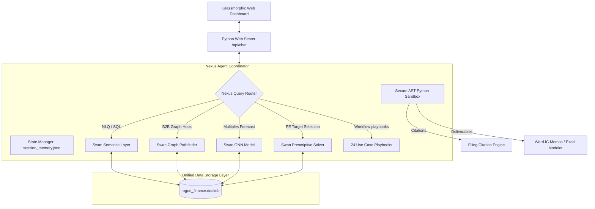

# 🚀 Rogo AI Analyst Rebuild Plan - Swan & DuckDB Integration

This document outlines the detailed system architecture, ontology schema mapping, and workflow orchestration design to rebuild the **Rogo AI Analyst** application in this workspace using our new **229-table DuckDB data warehouse** (`rogue_finance.duckdb`) and the **Swan semantic reasoning engine**.

---

## 📐 1. System Architecture

The rebuilt Rogo AI Analyst is structured as a neuro-symbolic financial intelligence platform, linking symbolic logic (Datalog/SQL), deep learning (GNNs), and mathematical programming (MILP).

---

## 🧬 2. Swan Ontology Mapping (`ontology.py`)

We define a unified Swan ontology that maps our relational DuckDB schema to semantic concepts, properties, and relationships.

### Concept Definitions
* **`Company`** (Identifier: `ticker`)
  * Properties: `company_name`, `cik`, `sector`, `industry`
  * Source Table: `companies`
* **`Country`** (Identifier: `country_name`)
  * Properties: `region`
  * Source Table: `countries`
* **`OHLCV`** (Identifier: `id`)
  * Properties: `date_time`, `open_val`, `high_val`, `low_val`, `close_val`, `volume`, `ticker`
  * Source Table: `ohlcv`
* **`EarningsEstimate`** (Identifier: `id`)
  * Properties: `earnings_date`, `ticker`, `beat`, `beat_streak`, `historical_beat_rate`, `avg_surprise_4q`
  * Source Table: `earnings_estimates_earnings_features_clean_1`
* **`BankruptcyRisk`** (Identifier: `id`)
  * Properties: `ticker`, `date`, `default_probability`
  * Source Table: `bankruptcy_risk_bankruptcy`
* **`CorporateBond`** (Identifier: `id`)
  * Properties: `symbol`, `bond_type`, `coupon_rate`, `credit_rating`, `maturity_date`
  * Source Table: `corporate_bonds_companybonds_sheet1`

---

## 🧠 3. Advanced Reasoning Modules

### Phase 1: Swan Graph Pathfinder (`path_reasoner.py`)
* Computes PageRank centrality and weakly connected components directly inside DuckDB using Swan's C++ logical caches (`use_cache=True`).
* Implements namespace suffixing (e.g. `(Company)` vs. `(Domain)`) to avoid name collisions.

### Phase 2: Swan GNN Predictor (`gnn_model.py`)
* Preprocesses categorical and continuous parameters using `PropertyTransformer`.
* Trains local PyG GNN models and exports compiled weights to ONNX format.
* Runs native C++ multiple predictions and feature explainability attribution queries (`ExplainNode`, `ExplainEdge`).

### Phase 3: Swan Prescriptive Optimizer (`optimizer.py`)
* Formulates acquisition target selection as a Mixed-Integer Linear Program.
* *Objective:* Maximize aggregate portfolio Net Income (incorporating tax shields).
* *Constraints:* Select exactly $K$ targets, limit total purchase cost below budget, and enforce sector allocation boundaries.

---

## 💼 4. Playbook Orchestrator (Solving the 24 Use Cases)

Instead of relying on simple text queries, the router will compile inputs and execute structural pipelines matching our 24 playbooks:

1. **Earnings Surprise Tracker:** Joins `earnings_estimates` with `ohlcv` using `DATE` cast comparison, flagging stocks with high beat streaks and low price adjustments.
2. **LBO Sourcing Engine:** Queries low-multiple companies (`fundamentals`), filters out patent litigation defendants (`patent_litigation`), audits CEO pay ratios (`ceo_salaries`), and outputs a dynamic `.xlsx` model with live formulas using `openpyxl`.
3. **Restructuring Contagion Simulator:** Evaluates upcoming maturity walls (`corporate_bonds`) at current yields (`interest_rate_spreads`), traces supplier links (`business_network`), and estimates downstream write-off exposures (`trade_credit`).
4. **Competitor Alignment:** Automates Hebbia covenant matrices, AlphaSense risk redlines, PitchBook syndicate pathfinders, S&P Capital IQ commitment allocation, and Bloomberg swap arbitrage solvers.

---

## 🎨 5. User Web App Interface (`web_app/`)

We will rebuild the glassmorphic console server exposing:
* `/api/chat`: Runs query compiling, sandbox checking, and outputs JSON answers.
* Interactive Cytoscape graph nodes showing B2B supplier dependencies.
* Multi-axis charts plotting EV/Sales multiples against revenue growth.
* Citation cards linking cell values back to row indices in `rogue_finance.duckdb`.
